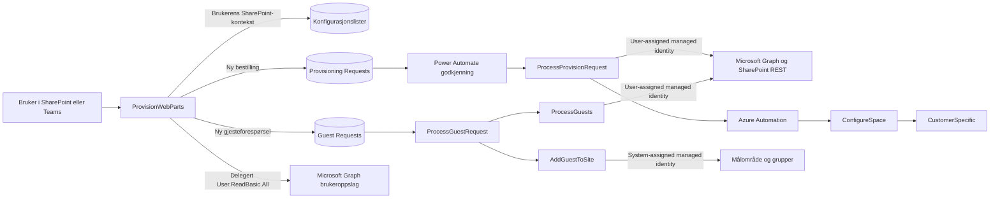
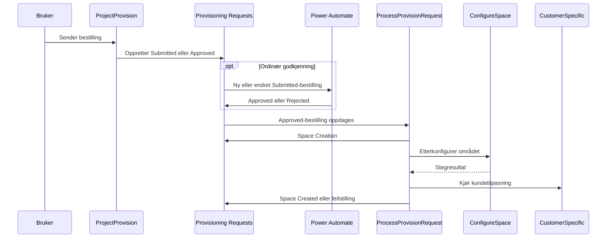
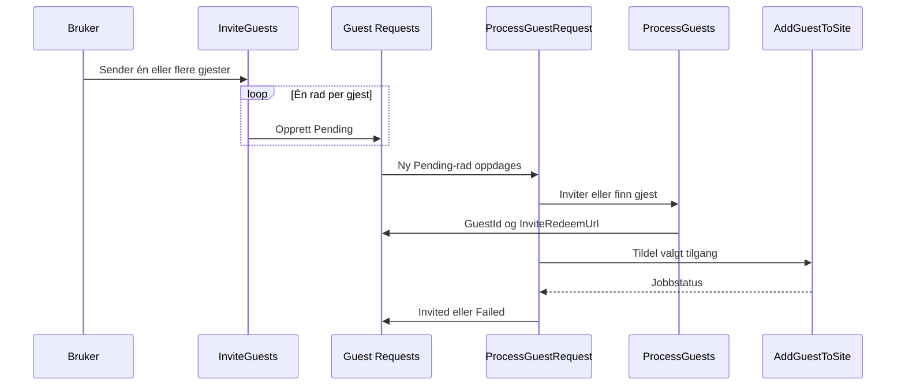

# Teknisk referanse for Bestillingsportalen-appen

Dette dokumentet beskriver SPFx-løsningen `ProvisionWebParts`: komponentene som kjører i SharePoint og Teams, dataene de leser og skriver, koblingen til resten av Bestillingsportalen og grensene mellom brukerens sikkerhetskontekst og bakgrunnsprosessene i Azure.

Dokumentet er rettet mot utviklere, løsningsforvaltere og tekniske administratorer. Sluttbrukerflyten er beskrevet i [brukerveiledningen](./App-brukerveiledning.md). Den samlede Azure-arkitekturen og alle driftstillatelser er beskrevet i [Teknisk løsningsbeskrivelse](./Teknisk-losningsbeskrivelse.md) og [Datatilgang og sikkerhet](./Data-access-security.md).

## 1. Omfang og kildekode

SPFx-pakken ligger i [`Source/SharePointFramework/ProvisionWebParts`](./Source/SharePointFramework/ProvisionWebParts) og inneholder to webdeler:

| Komponent          | Formål                                               | SharePoint | Teams                                                                                             |
| ------------------ | ---------------------------------------------------- | ---------- | ------------------------------------------------------------------------------------------------- |
| `ProjectProvision` | Bestille og følge samarbeidsområder                  | Webdel     | Personlig app                                                                                     |
| `InviteGuests`     | Invitere eksterne gjester til et eksisterende område | Webdel     | Støtter Teams-hosting i SPFx-manifestet, men inngår ikke som egen fane i den leverte Teams-pakken |

Den autoritative implementasjonen ligger under [`src`](./Source/SharePointFramework/ProvisionWebParts/src). Disse mappene er genererte byggartefakter og skal ikke redigeres direkte:

- `lib`
- `lib-commonjs`
- `dist`
- `release`
- `sharepoint`
- `temp`
- `jest-output`

### Plattform og sentrale avhengigheter

| Komponent            | Versjon eller rolle                         |
| -------------------- | ------------------------------------------- |
| SharePoint Framework | 1.23.2                                      |
| React                | 17.0.1                                      |
| Fluent UI            | v9                                          |
| PnPjs                | 4.13                                        |
| TypeScript           | 5.8                                         |
| Node.js              | `>=22.14.0 <23.0.0`; `.nvmrc` angir 22.14.0 |
| Byggsystem           | Heft med SPFx-riggen                        |

Pakkedefinisjonen finnes i [`package.json`](./Source/SharePointFramework/ProvisionWebParts/package.json), og SPFx-løsningen i [`config/package-solution.json`](./Source/SharePointFramework/ProvisionWebParts/config/package-solution.json).

## 2. Overordnet arkitektur

Klientappen oppretter ikke områder eller gjester direkte. Den validerer input og skriver forespørsler til SharePoint. Godkjenning og provisjonering utføres asynkront av Power Automate, Azure Logic Apps og Azure Automation.



### Kjørekontekster

| Del                                   | Identitet                                           | Konsekvens                                                                      |
| ------------------------------------- | --------------------------------------------------- | ------------------------------------------------------------------------------- |
| SPFx mot SharePoint                   | Innlogget bruker via SPFx/PnPjs                     | Brukeren kan bare lese og skrive det SharePoint-tillatelsene gir adgang til.    |
| SPFx mot Microsoft Graph              | Innlogget bruker, delegert `User.ReadBasic.All`     | Brukes bare til å finne eksisterende brukere ved gjesteinvitasjon.              |
| Godkjenningsflyt og connector-varsler | Tjenestekonto                                       | Power Automate, e-post og Teams-connectorer kjører som den autoriserte kontoen. |
| Logic Apps mot Graph og SharePoint    | User-assigned managed identity                      | Utfører tenantoperasjoner uten secret eller sertifikat.                         |
| Automation-runbooks                   | Automation-kontoens systemtildelte managed identity | Utfører PnP PowerShell-operasjoner mot tenant og målområder.                    |

SPFx-klienten er ikke en sikkerhetsgrense. Skjulte felt og menyvalg forbedrer brukeropplevelsen, men SharePoint-tillatelser, managed identity-app-roller og Azure RBAC håndhever den faktiske tilgangen.

## 3. Oppstart og valg av instans

### `ProjectProvision`

Startpunktet er [`src/webparts/projectProvision/index.ts`](./Source/SharePointFramework/ProvisionWebParts/src/webparts/projectProvision/index.ts).

Ved oppstart:

1. opprettes en PnPjs-klient med gjeldende SPFx-kontekst
2. Teams-kontekst oppdages
3. tilgjengelige Bestillingsportalen-instanser leses fra tenant storage entity `bp_ProvisionUrls`
4. mål-URL og brukerens tilgang kontrolleres
5. eventuell `SiteAssets/TeamsAppConfig.json` lastes i Teams
6. provisjoneringstyper lastes

URL-en løses i denne rekkefølgen:

| Kjøring    | Prioritet                                                                                                |
| ---------- | -------------------------------------------------------------------------------------------------------- |
| SharePoint | `provisionUrl` i webdelen, standardinstansen i `bp_ProvisionUrls`, deretter `/sites/bestillingsportalen` |
| Teams      | Tilgjengelige instanser fra `bp_ProvisionUrls`, filtrert på brukerens lesetilgang                        |

Hvis Teams-brukeren har tilgang til flere instanser, vises en instansvelger. Valget lagres i `localStorage`. Registeret mellomlagres i `sessionStorage`.

### `InviteGuests`

Startpunktet er [`src/webparts/inviteGuests/index.ts`](./Source/SharePointFramework/ProvisionWebParts/src/webparts/inviteGuests/index.ts).

Webdelen arbeider mot to områder:

- **gjeldende område**, der grupper, gruppetilknytning og brukerens tilgang leses
- **Bestillingsportalen-området**, der `Guest Requests` lagres

`guestRequestSiteUrl` vinner dersom egenskapen er satt. Ellers brukes standardinstansen i `bp_ProvisionUrls`, med `/sites/bestillingsportalen` som siste fallback.

## 4. `ProjectProvision`-arkitektur

### Komponentstruktur

| Område                                                                                                                                              | Ansvar                                                                      |
| --------------------------------------------------------------------------------------------------------------------------------------------------- | --------------------------------------------------------------------------- |
| [`ProjectProvision.tsx`](./Source/SharePointFramework/ProvisionWebParts/src/components/ProjectProvision/ProjectProvision.tsx)                       | Rotkomponent, meny, lastetilstander, tilgangsfeil og context provider.      |
| [`useProjectProvisionDataFetch.ts`](./Source/SharePointFramework/ProvisionWebParts/src/components/ProjectProvision/useProjectProvisionDataFetch.ts) | Leser innstillinger, typer, maler, merker og bestillinger.                  |
| [`useEditableColumn.ts`](./Source/SharePointFramework/ProvisionWebParts/src/components/ProjectProvision/useEditableColumn.ts)                       | Forvalter skjemaverdier, transformasjoner og typeavhengige standardverdier. |
| [`ProvisionDrawer`](./Source/SharePointFramework/ProvisionWebParts/src/components/ProjectProvision/ProvisionDrawer)                                 | Navigasjon, feltvisning, validering og innsending.                          |
| [`ProvisionStatus`](./Source/SharePointFramework/ProvisionWebParts/src/components/ProjectProvision/ProvisionStatus)                                 | Søk, sortering, statusvisning og tillatt sletting.                          |
| [`ProvisionSettings`](./Source/SharePointFramework/ProvisionWebParts/src/components/ProjectProvision/ProvisionSettings)                             | Visning av globale innstillinger. Redigering er ikke implementert.          |
| [`ProvisionService.ts`](./Source/SharePointFramework/ProvisionWebParts/src/services/ProvisionService.ts)                                            | Alle SharePoint-operasjoner for bestillingsflaten.                          |

`ProjectProvisionContext` deler props, tilstand, skjemakolonner og oppdateringsfunksjoner mellom komponentene. Klienttilstanden er definert i [`types.ts`](./Source/SharePointFramework/ProvisionWebParts/src/components/ProjectProvision/types.ts).

### Data som lastes

Etter tilgangskontroll lastes følgende parallelt fra valgt Bestillingsportalen-instans:

- globale innstillinger
- tillatte provisjoneringstyper
- områdemaler
- Teams-maler
- sensitivitetsmerker for område og bibliotek
- oppbevaringsmerker
- brukerens egne bestillinger

En bestilling vises i statusflaten når brukeren er oppretter (`Author`) eller er registrert i `RequestedBy`.

### Feltmodell

Standardfeltene defineres i [`getDefaultFields.ts`](./Source/SharePointFramework/ProvisionWebParts/src/components/ProjectProvision/getDefaultFields.ts). Hvert felt har:

- rekkefølge
- internt feltnavn
- visningsnavn og eventuell beskrivelse
- datatype
- ikon
- skjult, deaktivert og obligatorisk tilstand
- nivå i skjemaet

[`FieldRenderer`](./Source/SharePointFramework/ProvisionWebParts/src/components/ProjectProvision/ProvisionDrawer/FieldRenderer/FieldRenderer.tsx) renderer tekst, notat, valg, bryter, person, gjest og bilde fra samme feltmodell. Feltspesifikk dynamikk ligger i [`useFieldConfigs.tsx`](./Source/SharePointFramework/ProvisionWebParts/src/components/ProjectProvision/ProvisionDrawer/FieldRenderer/useFieldConfigs.tsx).

Typekonfigurasjoner i [`getFieldsForType.ts`](./Source/SharePointFramework/ProvisionWebParts/src/components/ProjectProvision/getFieldsForType.ts) kan:

- endre visningsnavn, beskrivelse og placeholder
- legge til skjulte felt
- legge til obligatoriske felt

De kan ikke eksplisitt gjøre et felt synlig eller valgfritt dersom grunnkonfigurasjonen allerede har satt `hidden: true` eller `required: true`.

### Viktige standardverdier

- gjeldende bruker settes normalt som eier
- personvern er privat med mindre områdetypen angir offentlig
- standardverdien i payloaden for Teams-mal er `standard`; brukergrensesnittet kan vise den som **Standard**
- språk og tidssone har norske standardverdier i klientmodellen
- Teams-mal-feltet er skjult med mindre `showTeamTemplateField` er aktivert
- intern kanal er skjult og deaktivert i standard feltdefinisjon
- auto-godkjenning er av med mindre den globale innstillingen aktiverer den

### Dynamisk feltlogikk

| Felt eller funksjon                             | Betingelse                                                                                                               |
| ----------------------------------------------- | ------------------------------------------------------------------------------------------------------------------------ |
| Teamify                                         | Tvunget på for typen `Microsoft Teams Team`; ellers type- eller brukerstyrt.                                             |
| Teams-mal                                       | Vises når Teams er aktivert og `showTeamTemplateField` er sann.                                                          |
| Ekstern deling                                  | Krever at valgt type tillater ekstern deling.                                                                            |
| Gjester                                         | Vises når ekstern deling er valgt.                                                                                       |
| Sensitivitets-, bibliotek- og oppbevaringsmerke | Krever tilhørende globale aktiveringsinnstilling.                                                                        |
| Utløpsdato                                      | Krever `EnableExpirationDate`.                                                                                           |
| Lesetilgangsgruppe                              | Krever `EnableReadOnlyGroup` og en feltdefinisjon som ikke er skjult.                                                    |
| Intern kanal                                    | Krever `EnableInternalChannel`, en feltdefinisjon som ikke er skjult/deaktivert, og kan avhenge av `readOnlyGroupLogic`. |
| Hub                                             | Vises når valgt type krever hub-tilknytning.                                                                             |

### Validering og duplikatkontroll

Før innsending kontrollerer klienten:

- obligatoriske synlige felt
- minimum antall eiere fra `MinimumOwners`
- samme person i eier- og medlemsfelt
- uløste personer
- eksisterende URL eller gruppealias
- aktive bestillinger med samme alias
- mislykket hub-oppslag
- pågående innsending, slik at dobbeltklikk ikke oppretter duplikater

URL- og bestillingskontroll utføres både mens brukeren skriver og på nytt rett før lagring.

### Opprettelse av bestilling

[`useProvisionDrawer.ts`](./Source/SharePointFramework/ProvisionWebParts/src/components/ProjectProvision/ProvisionDrawer/useProvisionDrawer.ts) bygger et `IProvisionRequestItem` og kaller `ProvisionService.addProvisionRequests`.

Payloaden omfatter blant annet:

- visningsnavn, alias, URL, beskrivelse og begrunnelse
- intern og ekstern områdetype
- eiere, medlemmer og bestiller
- Teams-valg og Teams-mal
- personvern, konfidensialitet, ekstern deling og gjester
- sensitivitets- og oppbevaringsmerker
- PnP-mal og områdetittel for mal
- hub, forelderområde og metadata
- utløpsdato, språk og tidssone
- lesetilgangsgruppe og intern kanal
- `RequestKey`, `Status` og `Stage`

Personfeltene fjernes fra det første `add`-kallet og skrives etterpå med `validateUpdateListItem`, slik at SharePoint løser principalene. Feiler dette, forsøker tjenesten å slette det ufullstendige elementet og returnerer en egen brukeroppløsningsfeil.

Når `EnableAutoApproval` er aktivert, settes `Status` og `Stage` direkte til `Approved`. Ellers settes de til `Submitted`.

## 5. Innstillinger brukt av bestillingsflaten

`ProvisionService.getProvisionRequestSettings` leser `Provisioning Request Settings`, filtrerer bort rader med `PowerAppOnly` og konverterer tekstverdiene `true` og `false` til boolske verdier.

| Nøkkel                           | Bruk i SPFx-klienten                                                        |
| -------------------------------- | --------------------------------------------------------------------------- |
| `EnableSensitivityLabels`        | Viser eller skjuler områdemerke.                                            |
| `DefaultSensitivityLabel`        | Global fallback for standard områdemerke.                                   |
| `EnableSensitivityLabelsLibrary` | Viser eller skjuler bibliotekmerke.                                         |
| `DefaultSensitivityLabelLibrary` | Global fallback for standard bibliotekmerke.                                |
| `EnableRetentionLabels`          | Viser eller skjuler oppbevaringsmerke.                                      |
| `DefaultRetentionLabel`          | Global fallback for standard oppbevaringsmerke.                             |
| `EnableExpirationDate`           | Viser eller skjuler utløpsdato.                                             |
| `EnableReadOnlyGroup`            | Gater feltet for lesetilgangsgruppe.                                        |
| `EnableInternalChannel`          | Gater feltet for intern kanal.                                              |
| `EnableAutoApproval`             | Oppretter bestillingen med status `Approved` i stedet for `Submitted`.      |
| `SPOManagedPath`                 | Brukes når foreslått URL bygges.                                            |
| `MinimumOwners`                  | Minimum antall eiere; ugyldig verdi faller tilbake til 1.                   |
| `UseNamingConventions`           | Velger global navnekonvensjon fremfor typekonvensjon.                       |
| `NamingConvention`               | Prefiks, suffiks og attributtbasert navngivning.                            |
| `EnableExternalSharingByDefault` | Skal styre standardverdi for ekstern deling. Se kjent begrensning nedenfor. |

`ProjectProvision` bruker PnPjs session-cache for innstillinger, provisjoneringstyper, maler og merker. En endring i SharePoint kan derfor kreve ny fane eller nettleserøkt før den leses på nytt. Gjesteforespørsler og `TeamsAppConfig.json` omfattes ikke av denne cachen.

## 6. SharePoint-kontrakter

### Lister lest av `ProjectProvision`

| Liste                           | Bruk                                                                 |
| ------------------------------- | -------------------------------------------------------------------- |
| `Provisioning Request Settings` | Globale nøkkel/verdi-innstillinger og navnekonvensjon.               |
| `Provisioning Types`            | Tillatte typer, synlighet, standardverdier, maler, hub og målgruppe. |
| `Site Templates`                | Tilgjengelige SharePoint- og PnP-maler.                              |
| `Teams Templates`               | Tilgjengelige Teams-maler og template-ID-er.                         |
| `IP Labels`                     | Sensitivitetsmerker for område og bibliotek.                         |
| `Retention Labels`              | Oppbevaringsmerker.                                                  |
| `Provisioning Requests`         | Opprettelse, duplikatkontroll og status for brukerens bestillinger.  |

Når metadataoppsett krever det, kan klienten også skrive prosjektinformasjon til `Prosjektdata` på et hub- eller forelderområde. Primitive felt, URL-, bruker-, taksonomi- og innholdstypefelt behandles særskilt. Lookup-felt hoppes over med vilje.

Fullt listeskjema finnes i [Datalagre](./Data-stores.md) og PnP-definisjonene under [`Source/Templates/Objects/Lists`](./Source/Templates/Objects/Lists).

### Bestillingsstatus

Klienten kjenner statusene:

- `Not Submitted`
- `Submitted`
- `Approved`
- `Rejected`
- `Pending Approval`
- `Space Creation Failed`
- `Space Already Exists`
- `Team Requested`
- `Space Creation`
- `Space Created`

Statusflaten tilbyr søk og sortering. Filterkommandoen er synlig i kildekoden, men deaktivert og ikke implementert. Sletting tillates bare for utvalgte terminale eller ikke-innsendte tilstander.

### Innstillingsflaten

`ProvisionSettings` viser konfigurasjonsrader, men redigeringshandlingen er deaktivert. Flaten skal derfor behandles som en lesevisning, ikke som primært administrasjonsverktøy. Innstillinger vedlikeholdes i SharePoint-listene eller gjennom webdelens egenskaper.

Synlighet i klienten er ikke tilgangskontroll. Beskytt innstillingslistene med SharePoint-tillatelser, uavhengig av menyegenskapene `hideSettingsMenu` og `AdminGroupId`-konfigurasjon i eldre oppsett.

### Tillatelser for sluttbrukere

Klienten kjører som innlogget bruker, så bestilleren trenger SharePoint-tillatelser på Bestillingsportalen-området. Ingen Entra ID- eller Graph-roller er nødvendige utover det SPFx gir; provisjoneringen utføres av managed identity og tjenestekontoen (se [Datatilgang og sikkerhet](./Data-access-security.md)). Oppsettet er beskrevet i Steg 3 i [Konfigurasjonsveiledningen](./Configuration-guide.md).

| Hvor                                                     | Minste tillatelse | Hvorfor                                                                                                                                                                                                                             |
| -------------------------------------------------------- | ----------------- | ----------------------------------------------------------------------------------------------------------------------------------------------------------------------------------------------------------------------------------- |
| Bestillingsportalen-området                              | Lese              | Tilgangskontrollen ved oppstart krever `ViewListItems`, og Teams-appen viser bare instanser brukeren kan lese. Innstillings-, type-, mal- og merkelistene leses.                                                                     |
| `Provisioning Requests`                                  | Bidra             | `items.add` oppretter bestillingen, `validateUpdateListItem` setter personfeltene på det nye elementet (krever redigering), og elementet slettes ved brukeroppløsningsfeil og når brukeren sletter en bestilling i statusflaten. |
| `Guest Requests` (kun `InviteGuests`)                    | Bidra             | Nye forespørsler legges til, og **Prøv på nytt** oppretter et nytt element og sender det gamle til papirkurven.                                                                                                                       |
| `Prosjektdata` på hub-/forelderområdet (kun ved metadata) | Bidra             | Skrives når typen har `DefaultMetadata` eller `parentMode` er aktivert. Personfelt løses med `web.ensureUser` mot hub-området, som krever mer enn lesetilgang der.                                                               |

`Legg til` alene er ikke tilstrekkelig på `Provisioning Requests`: opprettelsen lykkes, men oppdateringen av personfeltene feiler, og et element uten eiere blir liggende igjen fordi oppryddingen heller ikke har rettighet til å slette. `Rediger` fungerer, men gir også rett til å administrere listen.

Listene arver tillatelser fra området, med unntak av `PnP Templates`. Tilgangen må derfor gis ved å bryte arv på den enkelte listen. Merk at det ikke er satt elementnivå-sikkerhet: statusflaten filtrerer på bestiller i klienten, men alle med lesetilgang kan lese alle bestillinger, og alle med Bidra kan i praksis endre eller slette andres elementer via SharePoint.

## 7. Godkjenning og provisjonering



Godkjenningsflyten er ikke en del av React-appen. Den leveres som Power Automate-løsning og er beskrevet i [Godkjenningsflyt](./Approval-flow.md).

[`ProcessProvisionRequest`](./Source/ARMTemplates/LogicApps/processprovisionrequest.json) poller etter godkjente bestillinger. Den oppretter grupper, team, områder eller fellesskap, oppdaterer status og kaller [`ConfigureSpace.ps1`](./Source/Runbooks/ConfigureSpace.ps1) for PnP-baserte ettersteg. Automation-jobbens faktiske status kontrolleres eksplisitt fordi connectoren kan returnere HTTP 200 selv om runbook-jobben feilet.

[`CustomerSpecific.ps1`](./Source/Runbooks/CustomerSpecific.ps1) kjøres etter `ConfigureSpace` og er det støttede utvidelsespunktet for kundespesifikke handlinger. Standardfilen er en no-op. Deploy oppretter den én gang og overskriver den ikke ved senere oppgraderinger.

### Intern kanal

`InternalChannel` lagres bare som `true` når:

1. feltet er gjort synlig og aktivt i webdelkonfigurasjonen
2. `EnableInternalChannel` er sann
3. `readOnlyGroupLogic` er aktivert
4. brukeren har valgt lesetilgangsgruppe
5. brukeren slår på intern kanal

Hvis betingelsene ikke er oppfylt, tvinger klienten verdien til `false` ved innsending.

Logic App-en videresender `InternalChannel` til `ConfigureSpace` og `CustomerSpecific`, men standardimplementasjonen i `ConfigureSpace.ps1` bruker ikke parameteren. Standardløsningen oppretter eller fjerner derfor ingen Teams-kanal. Funksjonen må implementeres i `CustomerSpecific` eller i en annen kundetilpasning dersom den skal ha effekt.

## 8. `ProjectProvision`-egenskaper

Webdelen konfigureres fra SharePoint property pane. I Teams kan site admins i tillegg vedlikeholde JSON-konfigurasjonen `SiteAssets/TeamsAppConfig.json`.

### Generelt og visning

| Egenskap                                    | Betydning                                     |
| ------------------------------------------- | --------------------------------------------- |
| `buttonLabel`                               | Tekst på knappen som åpner skjemaet.          |
| `autoOwner`                                 | Legger inn gjeldende bruker som eier.         |
| `renderMode`                                | `button` eller `inline`. Teams bruker inline. |
| `parentMode`                                | Aktiverer flyt for forelderområde.            |
| `drawerSize`                                | `medium` eller `full`.                        |
| `siteTypeRenderMode`                        | Presentasjon av områdetypevalg.               |
| `expirationDateMode`                        | Dato eller månedsvalg for utløp.              |
| `level0Header` til `level2Header`           | Overskrifter for skjemanivåene.               |
| `level0Description` til `level2Description` | Beskrivelser for skjemanivåene.               |
| `footerDescription`                         | Tekst i skjemafoten.                          |

### Feltlogikk og tilgang

| Egenskap                    | Betydning                                                            |
| --------------------------- | -------------------------------------------------------------------- |
| `hideStatusMenu`            | Skjuler statusmenyen.                                                |
| `hideSettingsMenu`          | Skjuler innstillingsmenyen for vanlige brukere.                      |
| `defaultExpirationDate`     | Standard antall måneder i månedsmodus.                               |
| `readOnlyGroupLogic`        | Knytter intern kanal til valgt lesetilgangsgruppe.                   |
| `showTeamTemplateField`     | Viser Teams-mal når Teams er aktivert.                               |
| `requireProvisionAccess`    | Krever medlemskap i en SharePoint-gruppe på siden der webdelen står. |
| `provisionAccessGroupTitle` | Gruppenavn for tilgangskravet; standard er `Bestillingsportalen`.    |
| `excludedTypes`             | Områdetyper som webdelen ikke skal vise.                             |

### Avansert konfigurasjon

| Egenskap                                 | Betydning                                                                           |
| ---------------------------------------- | ----------------------------------------------------------------------------------- |
| `provisionUrl`                           | Absolutt URL til Bestillingsportalen-instansen. Tom verdi bruker tenant-registeret. |
| `fields`                                 | Full feltkonfigurasjon, inkludert rekkefølge, etiketter og synlighet.               |
| `typeFieldConfigurations`                | Typeavhengige etiketter, skjulte og obligatoriske felt.                             |
| `debugMode`                              | Klientens debugmodus.                                                               |
| `disabled`, `appearance`, `size`, `icon` | Knappens tilstand og utseende.                                                      |

Teams-editoren validerer at konfigurasjonen er gyldig JSON, men validerer ikke egenskaper eller verdier mot et skjema.

## 9. `InviteGuests`-arkitektur

### Komponenter og tjenester

| Område                                                                                                            | Ansvar                                                                                  |
| ----------------------------------------------------------------------------------------------------------------- | --------------------------------------------------------------------------------------- |
| [`InviteGuests.tsx`](./Source/SharePointFramework/ProvisionWebParts/src/components/InviteGuests/InviteGuests.tsx) | Rotkomponent, tilgangsgating, context og statusflate.                                   |
| [`InviteDrawer`](./Source/SharePointFramework/ProvisionWebParts/src/components/InviteGuests/InviteDrawer)         | E-post, profil, rolle, SharePoint-gruppe, validering og sammendrag.                     |
| [`InviteStatus`](./Source/SharePointFramework/ProvisionWebParts/src/components/InviteGuests/InviteStatus)         | Status, søk, retry og kopiering av innløsningslenke.                                    |
| [`GuestRequestService.ts`](./Source/SharePointFramework/ProvisionWebParts/src/services/GuestRequestService.ts)    | Leser, oppretter og prøver gjesteforespørsler på nytt.                                  |
| [`SiteService.ts`](./Source/SharePointFramework/ProvisionWebParts/src/services/SiteService.ts)                    | Leser gruppetilknytning, SharePoint-grupper, tillatelsesnivåer og brukerens områdenivå. |
| [`GraphService.ts`](./Source/SharePointFramework/ProvisionWebParts/src/services/GraphService.ts)                  | Slår opp eksisterende brukere via Microsoft Graph.                                      |

### Klientflyt

1. Webdelen kontrollerer tilgangsnivået `Owner`, `Member` eller `Anyone`.
2. Ved åpning lastes målområdets kontekst og tilgjengelige SharePoint-grupper.
3. E-postadresser valideres og slås opp i Graph.
4. Felles eller per-gjest profil- og rolleverdier bygges.
5. UI-handlingen `Preset` normaliseres til `AddToExisting`.
6. Ett `Pending`-element opprettes i `Guest Requests` per gjest.

Uautoriserte brukere får ingen synlig webdel. Dette erstatter ikke listetillatelser på den sentrale `Guest Requests`-listen.

### Roller og SharePoint-grupper

Nye forespørsler kan bruke M365-rollene:

- `Member`, vist som **Gjest** i brukergrensesnittet
- `None`

Nye forespørsler kan bare bruke `Member` eller `None`. Eldre rader kan inneholde `Visitor` eller `Owner`. Retry bevarer `Visitor`, mens `Owner` konverteres til `Member`; backend avviser nye forsøk på å gjøre en ekstern gjest til eier.

SharePoint-gruppehandlingene er:

- `None`
- `AddToExisting`
- `CreateNew`
- `Preset`, som er et UI-valg for en fast eksisterende gruppe

Administrator kan styre synlighet, rekkefølge, standardhandling, standardgruppe, Visitors-gruppe, tillatelsesnivå, låsing og allow-/deny-lister for grupper.

### Standardverdier

| Egenskap                      | Standard         |
| ----------------------------- | ---------------- |
| Visningsmodus                 | Dialog           |
| Invitasjonsmodus              | Flere gjester    |
| Tilgangsnivå                  | Bare områdeeiere |
| Profil per gjest              | Valgfritt        |
| Rolle per gjest               | Valgfritt        |
| M365-rolle                    | Gjest (`Member`) |
| SharePoint-gruppehandling     | Ingen            |
| Tillatelsesnivå for ny gruppe | `Read`           |
| Auto-velg Visitors-gruppe     | På               |
| Tilgangsforhåndsvisning       | På               |
| Statussammendrag              | På               |
| Kopier innløsningslenke       | På               |
| Prøv på nytt                  | På               |

### Gjesteforespørsel og backend

Webdelen skriver blant annet:

- gjestens e-postadresse i `Title`
- målområdets URL og tittel
- `Pending` status
- profilfelter
- M365-rolle
- SharePoint-gruppehandling, gruppenavn og tillatelsesnivå
- bestiller i `RequestedBy`



[`ProcessGuestRequest`](./Source/ARMTemplates/LogicApps/processguestrequest.json) poller nye elementer, kaller [`ProcessGuests`](./Source/ARMTemplates/LogicApps/processguests.json) og starter [`AddGuestToSite.ps1`](./Source/Runbooks/AddGuestToSite.ps1). Bestilleren registreres som sponsor i Entra ID.

Dersom deployment-parameteren `guestEntraGroup` er satt, legger `AddGuestToSite` hver invitert gjest til i den angitte Entra ID-gruppen. Verdien kan være gruppens objekt-ID eller et entydig visningsnavn. Feil ved gruppeoppslag eller medlemskap gjør gjesteforespørselen mislykket.

Retry oppretter en ny `Pending`-rad og flytter den mislykkede raden til SharePoint-papirkurven. Dette er nødvendig fordi Logic App-triggeren reagerer på nye elementer, men betyr at den opprinnelige raden ikke blir liggende i aktiv listehistorikk.

## 10. `InviteGuests`-egenskaper

### Generelt

| Egenskap                | Betydning                                |
| ----------------------- | ---------------------------------------- |
| `title`, `description`  | Webdelens overskrift og introduksjon.    |
| `displayMode`           | Status inline eller i dialog.            |
| `inviteMode`            | Én eller flere gjester.                  |
| `inviteAccessLevel`     | `Owner`, `Member` eller `Anyone`.        |
| `guestRequestSiteUrl`   | Området som inneholder `Guest Requests`. |
| `guestRequestListTitle` | Listenavn; standard er `Guest Requests`. |

### Profil og rolle

| Egenskap                   | Betydning                                           |
| -------------------------- | --------------------------------------------------- |
| `perGuestProfileMode`      | Per-gjest profil deaktivert, valgfri eller påkrevd. |
| `perGuestRoleMode`         | Per-gjest rolle deaktivert, valgfri eller påkrevd.  |
| `defaultM365GroupRole`     | `Member` eller `None`.                              |
| `lockM365GroupRole`        | Hindrer brukerendring.                              |
| `showM365GroupRoleSection` | Viser eller skjuler M365-rolle.                     |

### SharePoint-grupper

| Egenskap                                  | Betydning                                                      |
| ----------------------------------------- | -------------------------------------------------------------- |
| `defaultSpGroupAction`                    | Standard gruppehandling.                                       |
| `defaultSpGroupName`, `presetSpGroupName` | Standard eller låst gruppenavn.                                |
| `showSpActionNone`                        | Viser valget Ingen.                                            |
| `showSpActionAddToExisting`               | Viser eksisterende gruppe.                                     |
| `showSpActionCreateNew`                   | Viser opprett ny gruppe.                                       |
| `showSpActionPreset`                      | Viser forhåndsvalgt gruppe.                                    |
| `spGroupActionOrder`                      | Rekkefølge for gruppehandlingene.                              |
| `defaultSpPermissionLevel`                | Tillatelsesnivå for ny gruppe.                                 |
| `autoSelectVisitorGroup`                  | Bruker områdets Visitors-gruppe som standard.                  |
| `lockSpGroupAction`                       | Hindrer brukerendring.                                         |
| `showSPGroupSection`                      | Viser eller skjuler SharePoint-gruppevalg.                     |
| `hiddenSpGroups`, `allowedSpGroups`       | Deny-/allow-lister for tilgjengelige grupper. Skjuling vinner. |

### Status og forhåndsvisning

| Egenskap                      | Betydning                               |
| ----------------------------- | --------------------------------------- |
| `showAccessPreview`           | Viser beregnet tilgang før innsending.  |
| `showStatusSummary`           | Viser statusoppsummering.               |
| `showCopyRedeemUrl`           | Tillater kopiering av innløsningslenke. |
| `showRetryButton`             | Tillater ny forespørsel ved feil.       |
| `showColumnM365Role`          | Viser M365-rolle i status.              |
| `showColumnSPGroupAction`     | Viser gruppehandling i status.          |
| `showColumnSPGroupName`       | Viser gruppenavn i status.              |
| `showColumnSPPermissionLevel` | Viser tillatelsesnivå i status.         |

## 11. Caching og konsistens

| Cache               | Innhold                                                  | Levetid                                |
| ------------------- | -------------------------------------------------------- | -------------------------------------- |
| PnPjs `SPFI`-map    | Én klient per absolutt mål-URL                           | Webdelinstansens levetid               |
| PnPjs session-cache | `ProjectProvision`-innstillinger, typer, maler og merker | Nettleserøkt                           |
| `sessionStorage`    | `bp_ProvisionUrls`                                       | Nettleserøkt                           |
| `localStorage`      | Valgt Teams-instans                                      | Til brukeren bytter eller data slettes |

Bestillinger og gjesteforespørsler session-caches ikke. De hentes på nytt ved eksplisitt oppdatering eller refetch. `TeamsAppConfig.json` lastes separat fra SharePoint og omfattes heller ikke av tabellen.

Backend bruker polling, normalt med ett minutts intervall. UI og backend er derfor eventual consistent: en ny eller endret rad kan bruke tid før neste prosess starter.

## 12. Feilhåndtering og observabilitet

Klienten bruker lokaliserte feiltekster og toast-varsler for tilgangsfeil, navnekonflikt, brukeroppløsning og generell lagringsfeil. Ufullstendige bestillingsrader forsøkes ryddet bort når personfelt ikke kan løses.

Logic Apps skriver terminale feilstatuser og `StatusReason` eller `ErrorMessage` tilbake til SharePoint. `ConfigureSpace` registrerer `Succeeded`, `Skipped` eller `Failed` for hvert konfigurasjonssteg og samler feil før jobben avsluttes.

Det finnes ingen Application Insights-integrasjon eller strukturert klienttelemetri. Klientdiagnostikk er i hovedsak `console.log`, `console.warn` og `console.error`. `RequestKey` opprettes, men eksponeres ikke som en samlet korrelasjons-ID i brukergrensesnittet.

Operativ feilsøking er beskrevet i [Feilhåndtering](./Error-handling.md) og [`Source/Diagnostics/README.md`](./Source/Diagnostics/README.md).

## 13. Bygg, test og pakking

Kjør fra `Source/SharePointFramework/ProvisionWebParts`:

```sh
nvm use
npm install
npm start
npm test
npm run lint:check
npm run prettier:check
npm run build
```

| Kommando                 | Resultat                                            |
| ------------------------ | --------------------------------------------------- |
| `npm start`              | Starter Heft-utviklingsserveren på HTTPS port 4321. |
| `npm test`               | Kjører Heft/Jest-testene.                           |
| `npm run lint:check`     | Kjører ESLint uten å endre filer.                   |
| `npm run prettier:check` | Kontrollerer formatering.                           |
| `npm run build`          | Ren produksjonstest og `package-solution`.          |

Pakken bygges til:

```text
Source/SharePointFramework/ProvisionWebParts/sharepoint/solution/bp-provision-web-parts.sppkg
```

Løsningen bruker `skipFeatureDeployment: true` og kan distribueres tenant-wide. Den ber SharePoint om den delegerte Graph-tillatelsen `User.ReadBasic.All`.

Testdekningen er begrenset til et lite antall rene hjelpefunksjoner, blant annet instansoppløsning, minimum antall eiere og aliasberegning. React-flyter, tjenester, Logic App-kontrakter og runbook-grenser har ikke tilsvarende enhetstestdekning. Repoet har ingen CI; releasebygg og tenantverifisering utføres manuelt.

Se [CONTRIBUTING](./CONTRIBUTING.md) for lokal utvikling.

## 14. Distribusjon

[`deploy.ps1`](./Source/Scripts/deploy.ps1) finner SPFx-prosjekter under `Source/SharePointFramework`, kjører produksjonsbygg og publiserer `.sppkg` til tenantens appkatalog med overwrite, publish og tenant-wide deployment.

Viktige forhold:

- Node.js kreves dersom `-SkipSPFxDeploy` ikke brukes.
- Byggfeil registreres, men øvrig Azure-deploy kan fortsette. Kontroller derfor deploy-oppsummeringen.
- Teams-pakken bygges som `bestillingsportalen-teams-app.zip`.
- Automatisk publisering til Teams krever `AppCatalog.ReadWrite.All`; ellers lastes zip-filen opp manuelt.
- Teams-manifestet inneholder `ProjectProvision`, ikke en egen `InviteGuests`-app.
- SPFx-pakkens, Teams-manifestets og repoets versjonsverdier har ulike kilder. Deploy-skriptet setter Teams-versjonen fra solution-versjonen ved pakking.

Full installasjon er beskrevet i [Installasjonsveiledningen](./Deployment-guide.md), og oppsett etter installasjon i [Konfigurasjonsveiledningen](./Configuration-guide.md).

## 15. Tilpasningspunkter

| Tilpasning                               | Plassering                                                          |
| ---------------------------------------- | ------------------------------------------------------------------- |
| Globale funksjonsflagg og standarder     | `Provisioning Request Settings`                                     |
| Områdetyper, målgrupper og typeverdier   | `Provisioning Types`                                                |
| Globale felt og rekkefølge               | `fields` i webdelkonfigurasjonen                                    |
| Typeavhengige feltetiketter og krav      | `typeFieldConfigurations`                                           |
| Teams-konfigurasjon                      | `SiteAssets/TeamsAppConfig.json`                                    |
| SharePoint-spesifikk webdelkonfigurasjon | Property pane på siden                                              |
| Kundespesifikke provisjoneringssteg      | `CustomerSpecific`-runbooken i Azure                                |
| Lokalisering                             | [`src/loc`](./Source/SharePointFramework/ProvisionWebParts/src/loc) |
| PnP-maler og listeskjema                 | [`Source/Templates`](./Source/Templates)                            |

Rediger alltid TypeScript-kilden under `src`, ikke genererte JavaScript-filer.

## 16. Kjente begrensninger og vedlikeholdspunkter

Følgende punkter beskriver dagens implementasjon, ikke bare planlagt funksjon:

1. **Intern kanal har ingen standard backend-handling.** Flagget videresendes, men `ConfigureSpace` oppretter eller fjerner ingen kanal.
2. **Intern kanal er skjult og deaktivert som standard.** Både feltdefinisjon, globale innstillinger og `readOnlyGroupLogic` må harmonere for at brukeren skal kunne velge den.
3. **Standard ekstern deling har en typeuoverensstemmelse.** Innstillingsleseren konverterer `true` til boolsk `true`, mens standardverdilogikken sammenligner med tekstverdien `'true'`. `EnableExternalSharingByDefault` aktiverer derfor ikke standardvalget i dagens klientkode.
4. **Statusfilter er ikke implementert.** Søk og sortering fungerer, men filterkommandoen er deaktivert.
5. **Innstillingsredigering er ikke implementert.** `ProvisionSettings` er i praksis skrivebeskyttet.
6. **Typekonfigurasjon er additiv.** Den kan skjule og kreve flere felt, men ikke oppheve `hidden` eller `required` fra grunnfeltet.
7. **Teams-konfigurasjon valideres bare syntaktisk.** Ukjente eller ugyldige egenskaper kan lagres så lenge JSON-en er gyldig.
8. **Graph-oppslagsfeil tolkes som ikke funnet.** Tillatelses- eller tjenestefeil i gjesteoppslaget kan derfor se ut som en ny bruker.
9. **Status er ikke sanntid.** SharePoint-triggerne poller og gir forsinkelse.
10. **Gjeste-retry flytter originalen til papirkurven.** Dette kan påvirke hvordan aktiv listehistorikk leses.
11. **Klienttelemetri er begrenset.** Det finnes ingen sentral klientlogging eller Application Insights-korrelasjon.
12. **Automatisert testdekning er smal.** De viktigste integrasjonsgrensene verifiseres primært gjennom reelle tenanttester.
13. **Statuskolonnenes wrapper-defaults avviker fra komponent-defaults.** Manglende lagrede egenskaper for enkelte gjestekolonner tolkes som `false` av webpart-wrapperen.
14. **`InviteGuests` leveres ikke som egen Teams-appfane.** SPFx-manifestet støtter Teams-hosting, men den pakkede personlige Teams-appen eksponerer bare `ProjectProvision`.

Tekniske feil bør vurderes opp mot [Feilhåndtering](./Error-handling.md), mens sikkerhetsendringer alltid må vurderes mot [Datatilgang og sikkerhet](./Data-access-security.md).

## 17. Relatert dokumentasjon

- [Brukerveiledning for appen](./App-brukerveiledning.md)
- [Teknisk løsningsbeskrivelse](./Teknisk-losningsbeskrivelse.md)
- [Datalagre](./Data-stores.md)
- [Datatilgang og sikkerhet](./Data-access-security.md)
- [Installasjonsveiledning](./Deployment-guide.md)
- [Konfigurasjonsveiledning](./Configuration-guide.md)
- [Godkjenningsflyt](./Approval-flow.md)
- [Feilhåndtering](./Error-handling.md)
- [Retningslinjer for bidrag](./CONTRIBUTING.md)
