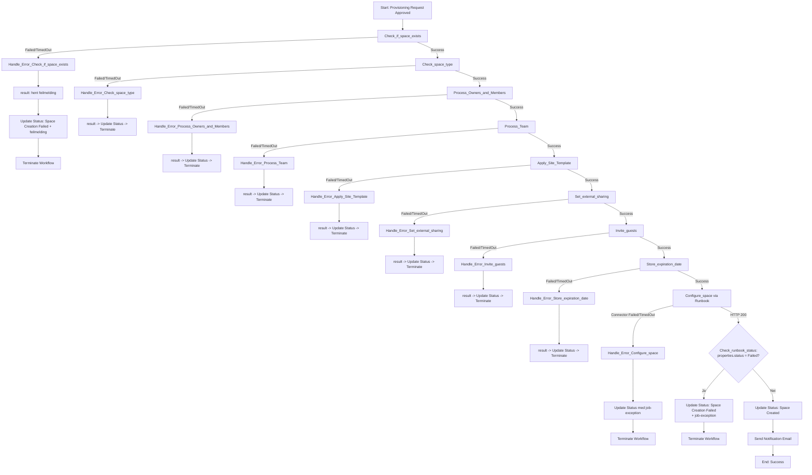
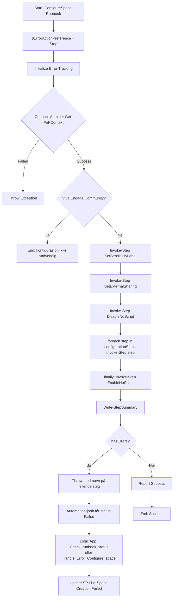
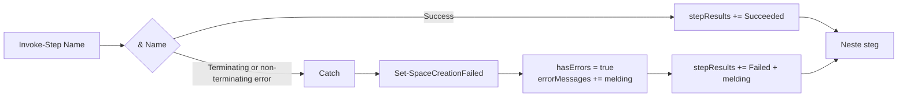

# Error Handling Flow Diagram

## Logic App Error Handling Flow

Hvert steg har et `Handle_Error_*`-scope som utløses på `Failed` eller `TimedOut`.
`Skipped` er ikke med: et steg blir Skipped først når en avhengighet feilet, og da har
den avhengighetens eget scope allerede kjørt `Terminate`.

Hvert scope henter den faktiske feilen med `result()` før statusen skrives, slik at
`StatusReason` inneholder både steget og den underliggende feilmeldingen.

`Check_runbook_status` finnes fordi Azure Automation-connectoren returnerer HTTP 200 selv
når runbook-jobben internt har status `Failed`. `Update Status: Space Created` er kjedet
etter denne sjekken, ikke etter `Configure_space` – ellers kunne de to kjørt i parallell
og stemplet bestillingen som opprettet før `Terminate` rakk å stoppe kjøringen.

Sensitivitetsmerking har ikke lenger eget scope her; den er et steg inne i runbooken.

## ConfigureSpace Runbook Error Handling Flow

## Invoke-Step

`Invoke-Step` erstatter de tidligere 22 identiske try/catch-blokkene i hvert steg.
Kombinert med `$ErrorActionPreference = 'Stop'` fanger den nå også ikke-terminerende
PnP-feil, som tidligere gikk rett forbi feilhåndteringen.

## Benefits

1. **Consistent Error Handling**: ett `Invoke-Step` i stedet for 22 kopier av samme try/catch
2. **Ingen stille feil**: `Stop` gjør at ikke-terminerende PnP-feil faktisk fanges
3. **Clear Visibility**: `StatusReason` inneholder den faktiske feilmeldingen, ikke en fast streng
4. **Detaljert jobblogg**: `Write-StepSummary` viser status per steg
5. **Graceful Degradation**: runbooken fortsetter selv om ett steg feiler, og `EnableNoScript` kjører alltid
6. **Aggregated Reporting**: alle feil samles og rapporteres sammen
