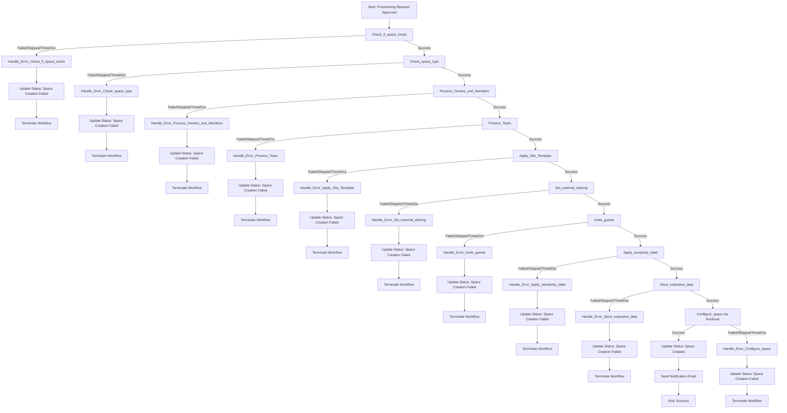
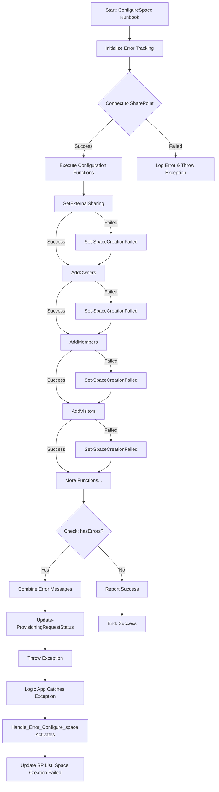
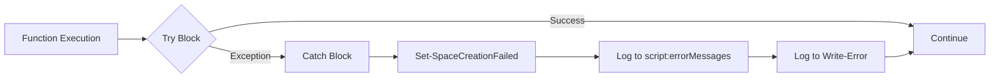

# Error Handling Flow Diagram

## Logic App Error Handling Flow

## ConfigureSpace Runbook Error Handling Flow

## Error Tracking in Functions

## Benefits

1. **Consistent Error Handling**: Same pattern across all steps
2. **Clear Visibility**: All errors visible in SharePoint list
3. **Detailed Logging**: Error messages identify exact failure point
4. **Graceful Degradation**: Runbook continues even if one function fails
5. **Aggregated Reporting**: All errors collected and reported together
