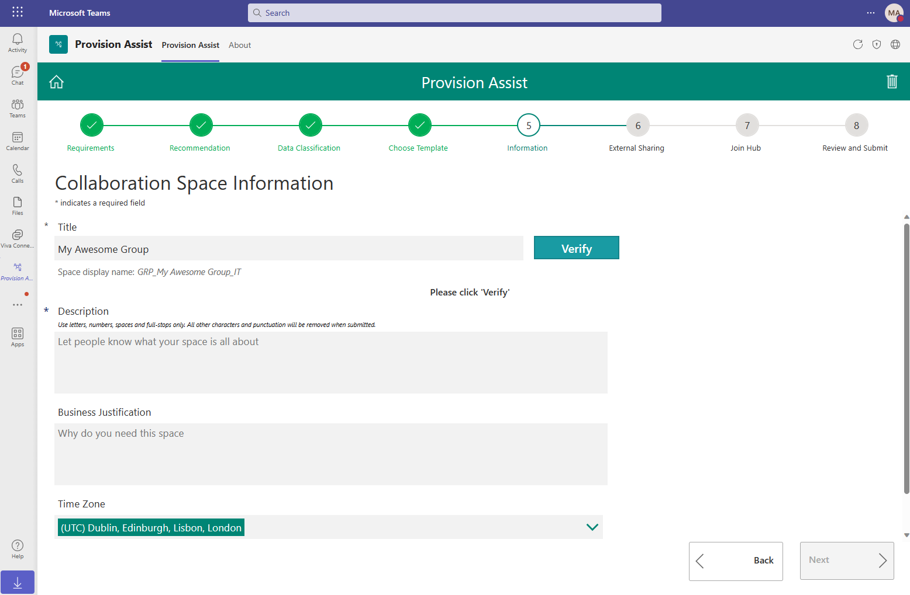
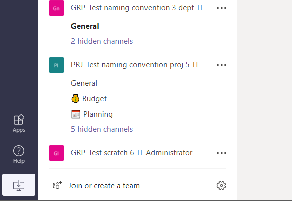
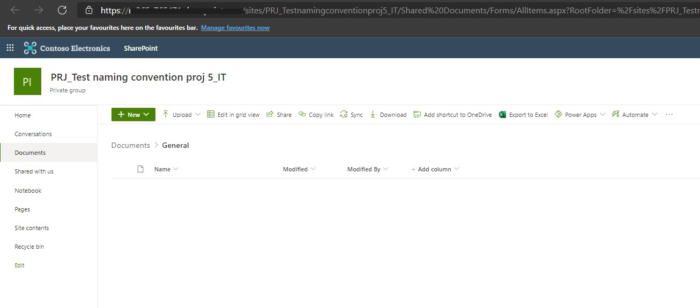
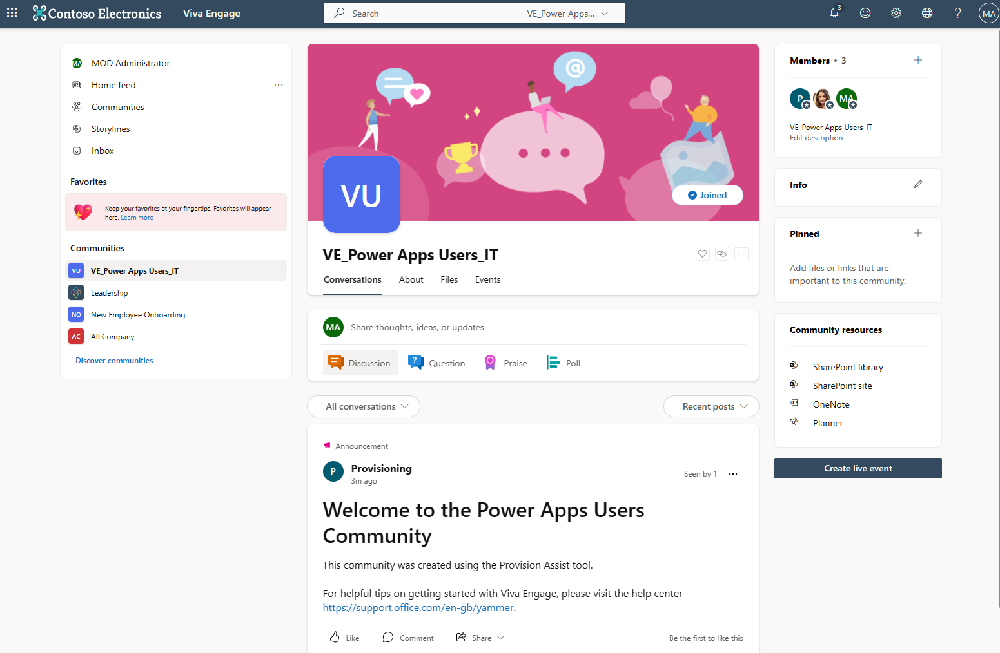
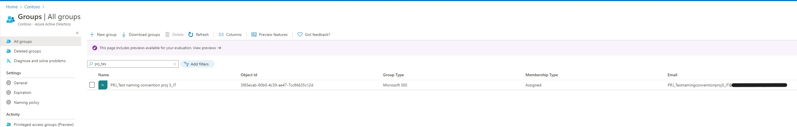
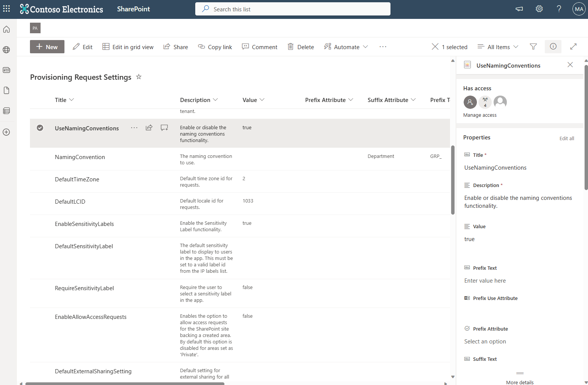
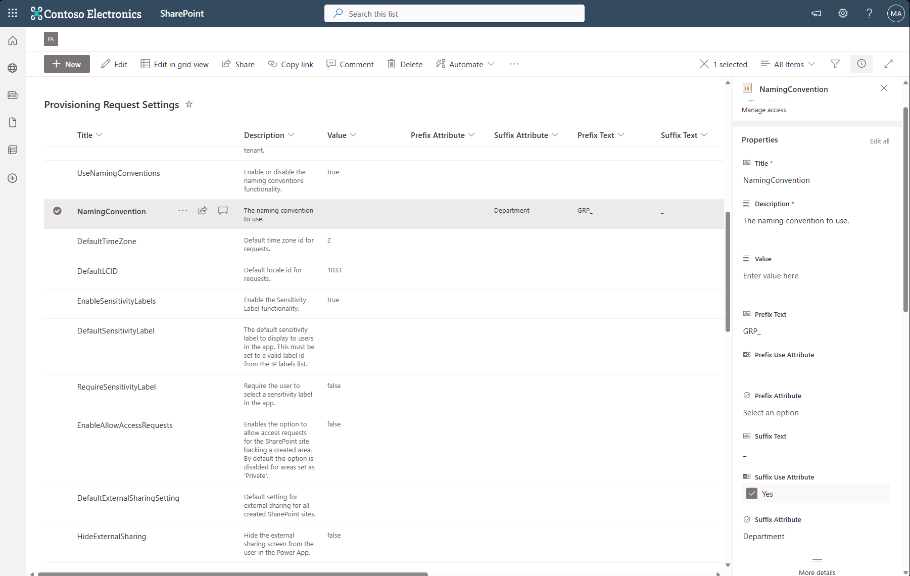
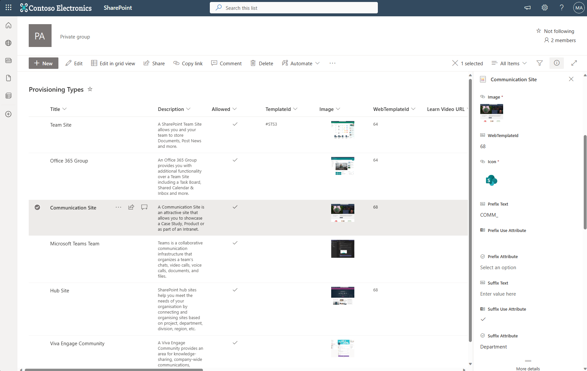
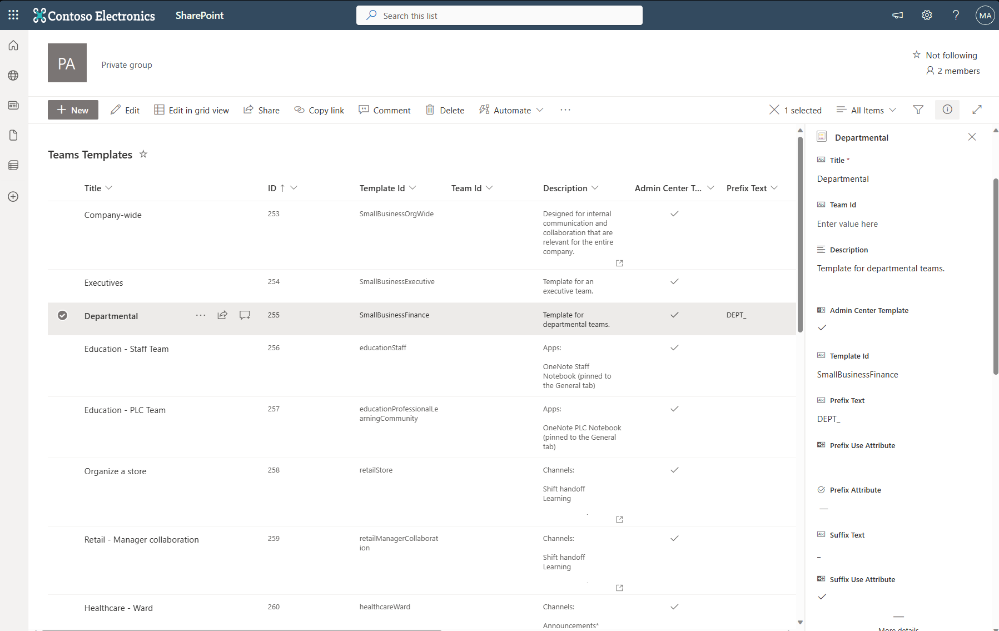

# Navnekonvensjoner

Bestillingsportalen inkluderer muligheten til å definere navnekonvensjoner/policyer for områder, grupper, Teams og Viva Engage-fellesskap som opprettes.

Når en bruker bestiller via Bestillingsportalen webdel eller Teams app, anvendes navnekonvensjonen, og en forhåndsvisning av hvordan navnet blir seende ut i kombinasjon med tittelen brukeren har angitt vises (se `Space display name` nedenfor).

Navnekonvensjoner kan konfigureres på følgende nivåer:

1. **Global** – Alle bestillinger følger denne navnekonvensjonen hvis ingen annen konvensjon er konfigurert som beskrevet nedenfor.
2. **Space** – Definer spesifikke navnekonvensjoner for hver områdetype (f.eks. Team Site, Communication Site, Office 365 Group). Områdetypene er de samarbeidstypene en bruker kan opprette, og de ligger i `Provisioning Types`-listen. Når en bruker velger en type med egen navnekonvensjon konfigurert, brukes denne.
3. **Teams Template** – Definer navnekonvensjoner spesifikt for en enkelt Teams-mal. Disse settes i `Teams Templates`-listen. En navnekonvensjon knyttet til en Teams-mal overstyrer den som er konfigurert for et Teams-team i `Provisioning Types`-listen.

**Global og områdetype** – Bestillinger opprettet der **ingen** navnekonvensjon er knyttet til den valgte områdetypen, bruker `Global`-konvensjonen. Der områdetyper har en egen konvensjon definert, brukes den.

**Teams-mal** – Overstyrer både global og områdetype hvis brukeren velger en Teams-mal med navnekonvensjon konfigurert.

Det finnes foreløpig ikke grensesnitt i webdel eller Teams app for å konfigurere dette (vi jobber med det), så navnekonvensjoner må settes opp i SharePoint-området inntil videre.

_Merk – Hvis ingen områdetyper eller Teams-maler har navnekonvensjon konfigurert og navnekonvensjoner er aktivert, vil malene bruke `Global`-konfigurasjonen._

## Hvordan ser dette ut?

**Teams:**

Når et team opprettes med navnekonvensjon, vises det slik:

- I eksemplet over er `GRP_` og `PRJ_` konfigurerte prefikser.
- Den midtre delen er områdets tittel som brukeren oppgir. Her har brukeren valgt å opprette et Teams-team.
- Alle tre eksemplene bruker attributter som suffiks. De to første er brukerens avdeling, og det siste teamet viser brukerens stillingstittel (`JobTitle`).
- Alle tre eksemplene bruker tekst (i tillegg til attributter) for å skille områdenavn/teamnavn med understreker. Dette er konfigurerbart – bindestreker osv. kan også brukes. **Eventuelle mellomrom i prefiks eller suffiks fjernes automatisk.**

**SharePoint-områder (Team Sites / Office 365 Groups / Communication Sites / Hub Sites og områder bak et team):**

Navnet og URL-en følger navnekonvensjonen:

Mellomrom i områdets tittel fjernes i URL-en til SharePoint-området.

**Viva Engage:**

Viva Engage-fellesskap oppfører seg på samme måte som et Teams-team. Visningsnavnet beholder mellomrom hvis de er spesifisert i områdets tittel, men aliaset på gruppen får mellomrommene fjernet.

F.eks.: `VE_My Viva Engage Community_IT` (der `IT` er brukerens avdeling).

**Entra ID:**

Gruppenavnet og e-postadressen i Entra ID matcher den spesifiserte navnekonvensjonen. Gruppenavnet beholder mellomrom, mens e-posten får disse fjernet automatisk.

## Konfigurasjon

For å aktivere funksjonaliteten MÅ verdien på innstillingen **`UseNamingConventions`** i `Provisioning Request Settings`-listen settes til `true`. Etter installasjon er denne satt til `false`.

### Global navnekonvensjon

Før du oppretter navnekonvensjoner på områdetype-/Teams-mal-nivå, bør du sette en global navnekonvensjon.

_Både et prefiks og/eller suffiks kan settes, og disse legges foran og etter områdets tittel angitt av brukeren._

---

For å sette en **global navnekonvensjon**, følg stegene nedenfor:

1. Gå til `Provisioning Request Settings`-listen i SharePoint-området.
2. Rediger listeelementet `NamingConvention` og angi følgende verdier (dette er eksempler – kan byttes ut med dine egne):

**Value** – La stå tom.
**PrefixAttribute** – La stå tom ELLER velg et attributt (fra brukerens profil). I dette eksemplet står det tomt.
**PrefixText** – Sett til `GRP_` (eller annen tekst du vil bruke som prefiks).
**PrefixUseAttribute** – Sett til `Yes` HVIS du valgte et attributt, ELLER `No` hvis ikke. I dette eksemplet: `No`.
**SuffixAttribute** – La stå tom ELLER velg et attributt. I dette eksemplet: `Department` (brukerens avdeling).
**SuffixText** – Sett til `_` i dette eksemplet (eller annen tekst).
**SuffixUseAttribute** – Sett til `Yes` HVIS du valgte et attributt, ELLER `No` hvis ikke. I dette eksemplet: `Yes`.

For alle andre felt: IKKE endre verdiene.

_Merk – Hvis du bruker PrefixText OG et PrefixAttribute, legges teksten til slutten av attributtverdien. Dette er slik at du kan skille attributtene/teksten fra områdets tittel, f.eks. `HR_`. Det samme gjelder SuffixText og SuffixAttribute._

3. Lagre listeelementet.

En global navnekonvensjon er nå konfigurert. Når et område bestilles, skal det se slik ut:

`GRP_Space Title_UsersDepartment` f.eks. `GRP_My New Site_HR`

Test navnekonvensjonen ved å opprette en ny bestilling.

Sørg for at brukere som bestiller har verdier konfigurert for attributtet du valgte – ellers får ikke attributtet noen verdi. Brukeren må altså ha en verdi for `JobTitle`, `Department`, `Company`, `Office`, `StateOrProvince` eller `CountryOrRegion`.

---

### Navnekonvensjon per områdetype

Navnekonvensjoner per områdetype lar deg sette spesifikke regler for hver type område en bruker kan bestille – Team Site, Office 365 Group, Microsoft Teams Team, Communication Site, Hub Site og Viva Engage Community. Disse vises på «Velg mal»-skjermen i Bestillingsportalen webdel eller Teams app. Hvis områdetyper har navnekonvensjoner definert, vil disse **overstyre** den globale.

I dette eksemplet anvender vi en spesifikk navnekonvensjon på Communication Sites.

Funksjonaliteten fungerer på samme måte som den globale navnekonvensjonen:

For å sette en **navnekonvensjon for en områdetype**, følg stegene nedenfor:

1. Gå til `Provisioning Types`-listen i SharePoint-området.
2. Rediger ett av listeelementene. Her velger vi `Communication Site`.
3. Konfigurer verdiene som følger:

**Prefix Text** – Sett til `COMM_` (eller annen tekst).
**Prefix Use Attribute** – `Yes` HVIS du valgte et attributt, ELLER `No`. I dette eksemplet: `No`.
**Prefix Attribute** – La stå tom ELLER velg et attributt. I dette eksemplet: tom.

**SuffixText** – Sett til `_` (eller annen tekst).
**Suffix Attribute** – La stå tom ELLER velg et attributt. I dette eksemplet: `Department`.
**Suffix Use Attribute** – `Yes` HVIS du valgte et attributt, ELLER `No`. I dette eksemplet: `Yes`.

4. Lagre listeelementet.

En navnekonvensjon for områdetype er nå konfigurert for Communication Site. Når en bruker velger Communication Site, skal navnet se slik ut:

`COMM_Space Title_UsersDepartment` f.eks. `COMM_My New Communication Site_HR`

Test navnekonvensjonen ved å opprette en ny bestilling og velge `Communication Site` på «Velg mal»-skjermen.

---

### Navnekonvensjon for Teams-maler

Navnekonvensjoner for Teams-maler lar deg sette spesifikke regler for Teams-maler (eller typer Teams). Hvis maler har navnekonvensjoner definert, vil disse **overstyre** både den globale og områdetype-nivåets konvensjoner.

For mer detaljer om hvordan du oppretter maler for bruk med Bestillingsportalen, se [Teams Templates](./Teams-templates.md).

I dette eksemplet anvender vi en navnekonvensjon på en av Microsofts innebygde maler. Du kan også definere egne maler og sette navnekonvensjoner på disse.

For å sette en **navnekonvensjon for en Teams-mal**, følg stegene nedenfor:

1. Gå til `Teams Templates`-listen i SharePoint-området.
2. Rediger ett av listeelementene. Her velger vi `Manage a Project`.
3. Konfigurer verdiene som følger:

**Prefix Text** – Sett til `DEPT_` (eller annen tekst).
**Prefix Use Attribute** – `Yes` HVIS du valgte et attributt, ELLER `No`. I dette eksemplet: `No`.
**Prefix Attribute** – La stå tom ELLER velg et attributt. I dette eksemplet: tom.

**SuffixText** – Sett til `_` (eller annen tekst).
**Suffix Attribute** – La stå tom ELLER velg et attributt. I dette eksemplet: `Department`.
**Suffix Use Attribute** – `Yes` HVIS du valgte et attributt, ELLER `No`. I dette eksemplet: `Yes`.

4. Lagre listeelementet.

En navnekonvensjon er nå konfigurert for den valgte malen. Når et område bestilles og brukeren velger `Departmental` Teams-malen, skal navnet se slik ut:

`DEPT_Team Name_UsersDepartment` f.eks. `DEPT_My Project Team_HR`

Test navnekonvensjonen ved å opprette en ny bestilling, velg `Use template` og `Departmental`-malen.

_Merk – Hvis du ønsker å definere en mal uten innhold, oppdater verdien på `Template Id` til `standard`._
