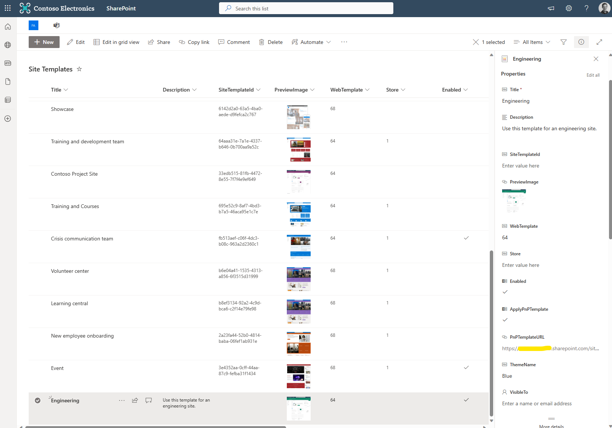

# PnP Templates

Bestillingsportalen støtter anvendelse av PnP Provisioning-maler når en bruker bestiller opprettelse av et SharePoint-område (Team Site, Office 365 Group, Communication Site eller Hub Site).

For øyeblikket kan disse anvendes **i stedet for** Site Templates og **kan ikke** anvendes på Microsoft Teams-team.

PnP-malfiler kan lagres i dokumentbiblioteket **`PnP Templates`**. Filene må være i **.pnp-filformat** for å fungere.

Se dokumentasjonen på <https://pnp.github.io/powershell/cmdlets/Save-PnPProvisioningTemplate.html> for hvordan du konverterer en PnP XML-fil til .pnp-format.

Når du har lastet opp PnP-malfilene, må du legge til en referanse til malen i listen **`Site Templates`**. Dette kobler PnP-malen til Site Templaten.

For å opprette en referanse til en PnP-mal, opprett et element i Site Templates-listen med følgende kolonner:

- **Title** – Tittel på malen, f.eks. «Engineering»
- **Description** – Beskrivelse av malen
- **Enabled** – Om malen skal vises i Bestillingsportalen webdel eller Teams app for valg.
- **ApplyPnPTemplate** – Sett til `Ja`
- **PnPTemplateURL** – Lim inn URL-en til PnP-malfilen fra dokumentbiblioteket **`PnP Templates`**. **VIKTIG: Sørg for at dette er den fullstendige stien til filen, ikke en snarvei-lenke.**
- **ThemeName** – Navn på et SharePoint-tema i tenanten som skal anvendes etter at området er opprettet. Temaer kan ikke settes i PnP-maler, så dette gir mulighet til å anvende et tema. Kan være et «out of the box»-tema eller et egendefinert tema.

Skjermbildet nedenfor viser en PnP-mal i Site Templates-listen. La alle andre kolonner stå tomme.

Når en bruker velger malen i Bestillingsportalen webdel eller Teams app, vil den tilknyttede PnP-malen anvendes på området ved hjelp av Logic App-en `ProcessProvisionRequest` og PnP PowerShell gjennom Azure Automation-runbooken `ConfigureSpace`.

_I en fremtidig oppdatering vil vi se på støtte for PnP-maler for Microsoft Teams-team, samt muligheten til å anvende både en Site Template OG en PnP-mal._
