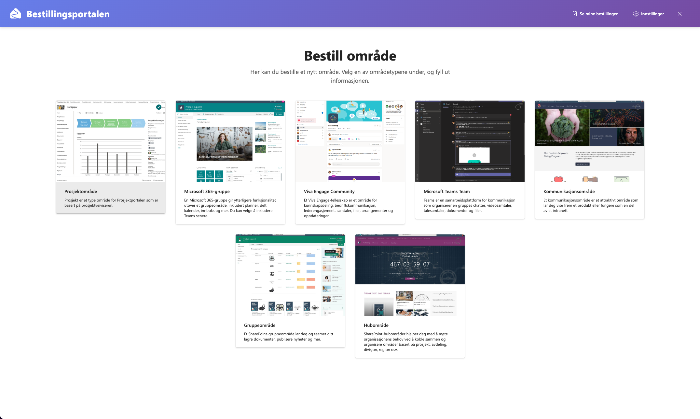
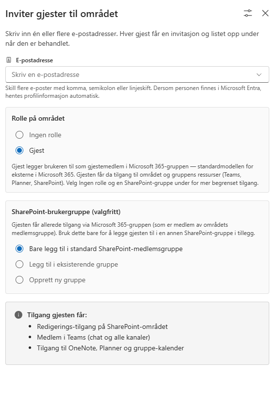
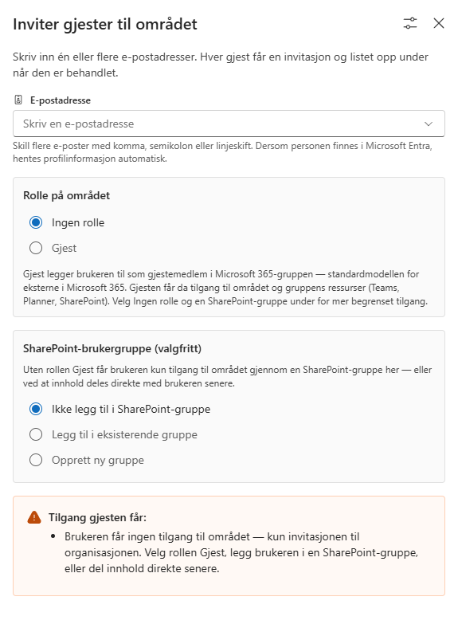

  
   
  <strong style="font-size: 2em;">Bestillingsportalen</strong>
   
  Styrt selvbetjening av samarbeidsområder i Microsoft 365

> **English summary.** Bestillingsportalen ("the ordering portal") is an open-source, Azure-based governance solution for Microsoft 365. Users order Teams, Microsoft 365 groups, SharePoint sites and Viva Engage communities from a SharePoint Framework (SPFx) web part or Teams app. Each request goes through a configurable Power Automate approval and is then provisioned automatically by Azure Logic Apps and Azure Automation, authenticating with managed identities only. It is a Norwegian-language derivative of Microsoft's [Provision Assist](https://github.com/pnp/provision-assist-m365). The user interface and all documentation are in Norwegian.

Bestillingsportalen er en Azure-basert løsning som gir et styrt alternativ til selvbetjent opprettelse av samarbeidsområder i Microsoft 365. Brukere bestiller Teams, Microsoft 365-grupper, SharePoint Online-områder og Viva Engage-fellesskap fra en webdel eller Teams-app bygget på SharePoint Framework (SPFx). Bestillingen godkjennes i en konfigurerbar Power Automate-flyt, og bakenforliggende Azure-komponenter provisjonerer området automatisk med navnekonvensjoner, maler, merker og innstillinger organisasjonen har bestemt. Bestillingsportalen kan brukes som del av en Copilot for Microsoft 365-utrulling for å etablere styring over selvbetjening.

## Hvem er løsningen for

- **Organisasjoner** som vil la ansatte opprette samarbeidsområder selv, men med godkjenning, navnekonvensjoner og standardoppsett – uten å åpne fri gruppeopprettelse i tenanten.
- **Bestillere** møter løsningen som en app i Teams eller en webdel i SharePoint, og ser status på egne bestillinger i et dashbord.
- **Godkjennere** behandler bestillinger i en Teams-kanal via Approvals.
- **Administratorer** installerer løsningen med et PowerShell-skript i egen Azure-subscription og Microsoft 365-tenant, og konfigurerer den gjennom SharePoint-lister. Ingenting kjører utenfor din egen tenant.

## Funksjonalitet

- SPFx-basert webdel og Teams-app (`ProjectProvision`) som lar brukere bestille samarbeidsområder. Fra og med 1.0.0 inngår webdelen i dette repoets pakke `bp-provision-web-parts` (SPFx 1.23, Fluent UI v9) – tidligere fulgte den med [Prosjektportalen 365](https://github.com/Puzzlepart/prosjektportalen365).
- Konfigurerbar godkjenningsprosess via Power Automate.
- SharePoint-område med støttelister som utgjør backenden for løsningen: områdetyper, maler, navnekonvensjoner, merker, forretningsenheter og innstillinger.
- Dashbord for bestillere som viser tidligere og pågående bestillinger med godkjenningsstatus.
- Automatisert provisjonering via Azure Logic Apps og Azure Automation (PnP PowerShell), inkludert hub-tilknytning, PnP-maler, sensitivitets- og oppbevaringsmerker.
- Selvbetjent invitasjon av eksterne gjester via `InviteGuests`-webdelen (samme SPFx-pakke), som kan plasseres på et hvilket som helst SharePoint-område. Invitasjoner skrives til `Guest Requests`-listen og prosesseres av `ProcessGuestRequest` Logic App.
- Støtte for flere installasjoner i samme tenant, med instansvelger i Teams-appen.

### Gjesteinvitasjon

Webdelen låser rollen til **Gjest** – gjestemedlemskap i Microsoft 365-gruppen, standardmodellen for eksterne i Microsoft 365 – eller **Ingen rolle**. Hjelpetekster og tilgangsforhåndsvisningen tilpasser seg valget, og velges verken rolle eller SharePoint-gruppe varsles avsenderen om at invitasjonen alene ikke gir tilgang til området:

| Rollen Gjest (standard) | Ingen rolle |
|--|--|
|  |  |

Bestilleren registreres alltid som gjestens **sponsor** i Entra ID – feltet Microsoft selv fyller ut ved manuell invitasjon, men som ellers ville stått tomt her fordi Bestillingsportalen inviterer app-only. Dermed er det dokumentert på selve gjestekontoen hvem i organisasjonen som står bak den eksterne brukeren.

I tillegg kan installasjonen konfigureres med en **felles Entra ID-gruppe for gjester** (installasjonsparameteren `guestEntraGroup`): hver invitert gjest legges da også inn i denne gruppen, slik at organisasjonen kan gi alle gjester grunntilgang ett sted – for eksempel lesetilgang på hub-området og app-katalogen. Valgfritt og avslått som standard, se [Installasjonsveiledningen](./Deployment-guide.md).

## Arkitektur

Løsningen bruker Microsoft Graph og SharePoint REST API-ene for provisjonering. Azure Automation-runbooks brukes sammen med PnP PowerShell for oppgaver som ikke kan utføres via Graph API.

Logic Apps autentiserer mot Microsoft Graph, SharePoint REST og Azure Automation med en user-assigned managed identity, og runbookene med Automation-kontoens systemtildelte identity. **Løsningen har ingen client secret, ingen Key Vault og ingen egen Entra ID-app-registrering i drift** – ingenting som må fornyes eller kan lekke.

> **Om tilganger:** Løsningen tildeles et minimert sett API-tillatelser der hver tillatelse er knyttet til konkrete kjøretidskall – se [Datatilgang og sikkerhet](./Data-access-security.md) for den fulle koblingen. Merk at noen av tillatelsene kun er i bruk av **valgfri funksjonalitet**: gjesteinvitasjon (`User.Invite.All`, `User.ReadWrite.All`), Viva Engage-fellesskap (`Community.ReadWrite.All`) og sensitivitetsmerker (`InformationProtectionPolicy.Read.All`). Organisasjoner som ikke bruker disse funksjonene kan stramme inn ytterligere – se merknaden om funksjonsbundne tillatelser i sikkerhetsdokumentet.

Provisjonering og andre automatiseringsoppgaver løses gjennom Azure Logic Apps (forbruksplan), som gir lav kjøretidskostnad. Godkjenningsflyten bruker seeded Power Automate-lisenser og krever ikke premium-lisensiering.

For arkitekturdiagrammer og en samlet oversikt over hva som installeres og hvilke tilganger som kreves – både for installasjon og for løsningen i drift – se [Teknisk løsningsbeskrivelse](./Teknisk-losningsbeskrivelse.md).

## Kom i gang

Installasjonen gjøres av en administrator med et PowerShell-skript, etterfulgt av noen manuelle konfigurasjonssteg. Den fullstendige sjekklisten står i [Installasjonsveiledningen](./Deployment-guide.md#forutsetninger); kortversjonen er:

**Dette trenger du**

- En Microsoft 365-tenant med tenant app-katalog i SharePoint og Power Automate (seeded-lisenser) aktivert.
- Et fakturerbart Azure-abonnement i samme tenant, der du er Owner (eller Contributor + User Access Administrator på ressursgruppen).
- En konto som er SharePoint Administrator og kan tildele app-roller til managed identities (Global Administrator – eller kjør med `-SkipAppRoles` og la en Global Administrator fullføre det steget).
- En tjenestekonto med Microsoft 365-lisens (E- eller F-lisens) som eier godkjenningsflyten og API-tilkoblingene.
- En app-registrering for PnP PowerShell i tenanten (interaktiv pålogging, ingen sertifikater).
- En Windows-maskin med PowerShell 7.4+, Azure CLI, PnP.PowerShell 3.2+ og Az-modulen. Node.js 22 trengs kun hvis SPFx-pakken skal bygges lokalt.

**Rekkefølge**

1. **Les [Teknisk løsningsbeskrivelse](./Teknisk-losningsbeskrivelse.md).** Den beskriver hva som installeres, hvilke tilganger installasjonen og driften krever, og kan brukes som underlag for sikkerhetsvurdering før dere begynner.
2. **Hent koden.** Klon repoet eller last ned [nyeste release](https://github.com/Puzzlepart/bestillingsportalen/releases). Skriptene ligger i `Source/Scripts/`.
3. **Følg [Installasjonsveiledningen](./Deployment-guide.md).** `GenerateParameters.ps1` lager parameterfila fra tenanten du er logget inn i, `deploy.ps1 -Preflight` sjekker alle forutsetningene uten å installere noe, og `deploy.ps1` oppretter Azure-ressursene, SharePoint-området og SPFx-pakken.
4. **Fortsett i [Konfigurasjonsveiledningen](./Configuration-guide.md).** Den tar over med godkjenningskanal, import av Power Automate-flyten, deling, aktivering av Teams-appen og en verifiserende testbestilling.

Løsningen er ikke i drift før både steg 3 og 4 er gjennomført. Merk at Bestillingsportalen-appen i Teams normalt må lastes opp manuelt i Teams admin center (zip-pakken produseres av deploy-skriptet) – se [Teams-appen](./Deployment-guide.md#teams-appen) i installasjonsveiledningen.

Skal du utvikle på webdelene, se [Bygge og kjøre webdelene lokalt](./CONTRIBUTING.md#bygge-og-kjøre-webdelene-lokalt).

## Oppgradering

Hvis du har en eksisterende Bestillingsportalen-installasjon og vil oppgradere til nyeste versjon, se [Oppgraderingsveiledningen](./Upgrade.md) for detaljerte instruksjoner om hvordan du oppgraderer uten å miste data.

Kjører miljøet en versjon fra **før 1.0** – med Key Vault, client secret og sertifikat – gjelder [Oppgradere fra versjoner før 1.0](./Upgrade-from-pre-1.0.md) i stedet. Slike miljøer må gjennom én full installasjon før `-Upgrade` kan brukes.

## Forholdet til Provision Assist

Bestillingsportalen bygger på [Provision Assist](https://github.com/pnp/provision-assist-m365) fra Microsoft 365 & Power Platform Community (PnP). Backenden – SharePoint-listene, Logic Apps, runbooks og godkjenningsflyten – har samme opprinnelse, men løsningen har utviklet seg i egen retning:

- Canvas-appen i Power Apps er erstattet av en SPFx-webdel og Teams-app, slik at bestillingsflaten ikke krever Power Apps-lisensiering og følger SharePoint- og Teams-temaet.
- All autentisering i drift går via managed identities. Client secret, Key Vault og Entra ID-app-registreringen fra upstream er fjernet.
- Gjesteinvitasjon (`InviteGuests`-webdelen) med sponsor-registrering og valgfri felles gjestegruppe.
- Installasjonsskriptet har pre-flight-sjekker, oppgraderingsmodus og støtte for flere installasjoner i samme tenant.
- Power Automate-pakken er trimmet til godkjenningsflyten – se [Source/Flows/README.md](./Source/Flows/README.md) for hvordan pakken avledes fra upstream.
- Brukergrensesnitt og dokumentasjon er på norsk.

## Status og vedlikehold

- Gjeldende versjon står i [`VERSION`](./VERSION); endringer per versjon i [endringsloggen](./CHANGELOG.md). Versjonering følger [SemVer](https://semver.org/lang/no/) som beskrevet i [retningslinjene for bidrag](./CONTRIBUTING.md#versjonering).
- Løsningen er i produksjonsbruk hos norske organisasjoner. Repoet vedlikeholdes av Prosjektportalen-teamet hos SoftwareOne, som også eier opphavsretten (se [LICENSE](./LICENSE)).
- Repoet har ingen CI. Releaser bygges og tagges manuelt, og installasjonen verifiseres i reelle tenanter før release.
- Feil og forslag håndteres via GitHub issues etter beste evne, uten garantert responstid. Trenger organisasjonen din bistand til installasjon eller tilpasning, ta kontakt med vedlikeholderne.

## Feil og problemer

Rapporter eventuelle problemer ved å opprette et [issue](https://github.com/Puzzlepart/bestillingsportalen/issues/new). Sikkerhetssårbarheter rapporteres privat – se [SECURITY.md](./SECURITY.md).

## Bidra

Vi elsker å motta bidrag.

Se våre [retningslinjer for bidrag](./CONTRIBUTING.md) for hvordan du kan bidra, inkludert hvordan du bygger webdelene lokalt.

Hvis du ønsker å bli involvert i å videreutvikle Bestillingsportalen – enten det er å foreslå ny funksjonalitet, oppdatere dokumentasjonen eller fikse bugs – vil vi gjerne høre fra deg.

## Lisens

Bestillingsportalen er lisensiert under [MIT-lisensen](./LICENSE) © SoftwareOne. Løsningen er basert på [Provision Assist](https://github.com/pnp/provision-assist-m365) fra Microsoft 365 & Power Platform Community (PnP), også MIT-lisensiert – opphavsnotisen deres er beholdt i lisensfila.

## Dokumentasjon

**Kom i gang**

- [Brukerveiledning for Bestillingsportalen-appen](./App-brukerveiledning.md) – bestilling, status og gjesteinvitasjon
- [Teknisk løsningsbeskrivelse](./Teknisk-losningsbeskrivelse.md) – komponenter, arkitektur og tilganger
- [Installasjonsveiledning](./Deployment-guide.md) – forutsetninger og den skriptede installasjonen
- [Konfigurasjonsveiledning](./Configuration-guide.md) – godkjenning, flyt-import, deling og Teams-app

**Drift**

- [Oppgraderingsveiledning](./Upgrade.md) og [Oppgradere fra versjoner før 1.0](./Upgrade-from-pre-1.0.md)
- [Feilhåndtering](./Error-handling.md)
- [Endringslogg](./CHANGELOG.md)

**Konfigurasjon og funksjoner**

- [Provisioning Types](./Provisioning-types.md) – områdetypene brukerne kan bestille
- [Site Templates](./Site-templates.md), [Teams Templates](./Teams-templates.md) og [PnP Templates](./PnP-templates.md)
- [Navnekonvensjoner](./Naming-conventions.md) og [Forretningsenheter](./Business-units.md)
- [Godkjenningsflyt](./Approval-flow.md)
- [Sensitivitetsmerker](./Sensitivity-labels.md) og [Oppbevaringsmerker](./Retention-labels.md)
- [Regionale innstillinger](./Regional-settings.md)

**Referanse**

- [Teknisk referanse for Bestillingsportalen-appen](./App-teknisk-referanse.md) – SPFx-komponenter, dataflyt, konfigurasjon, bygg og kjente begrensninger
- [Datalagre](./Data-stores.md) – alle lister og felter
- [Datatilgang og sikkerhet](./Data-access-security.md) – hver tillatelse koblet til kjøretidskallene som bruker den
- [Power Automate-pakken](./Source/Flows/README.md) og [diagnoseskript](./Source/Diagnostics/README.md)
