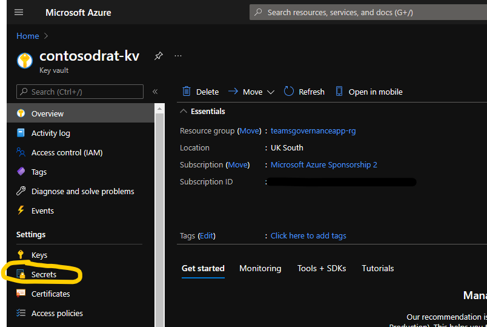
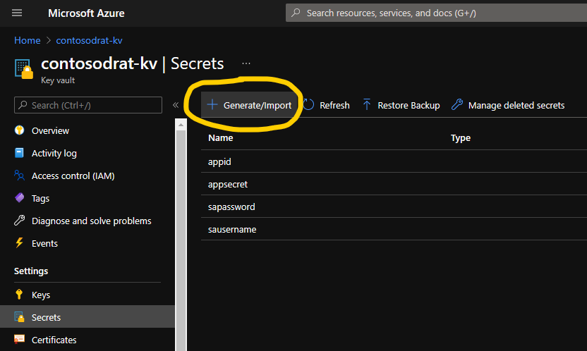
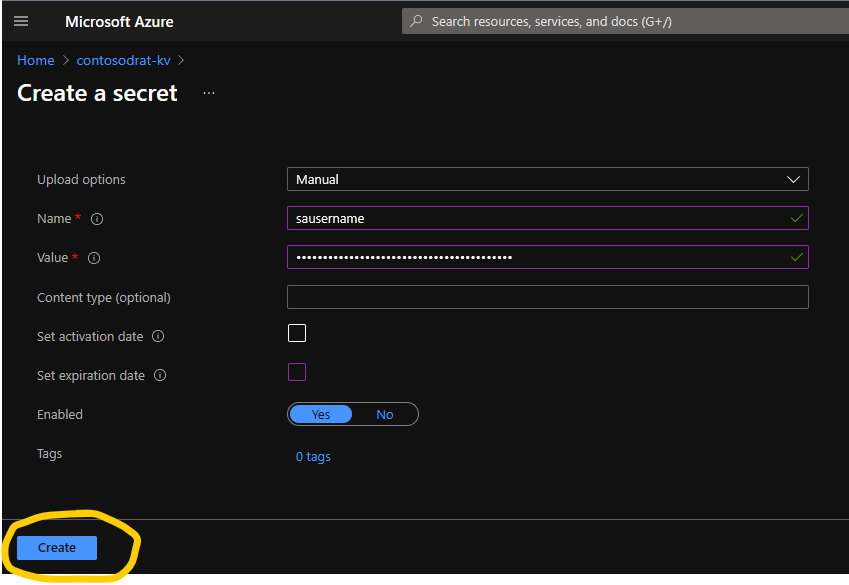

# Sensitivitetsmerker

Bestillingsportalen støtter anvendelse av sensitivitetsmerker på opprettede Teams eller Office 365 Groups.

For å bruke denne funksjonaliteten må sensitivitetsmerker være aktivert for Teams og Groups. Mer informasjon finnes på <https://learn.microsoft.com/en-us/microsoft-365/compliance/sensitivity-labels-teams-groups-sites?view=o365-worldwide>.

**Du må ha merker opprettet i Microsoft Purview Compliance Portal og publisert med Label Policies før dette fungerer. Vent 24 timer etter at merker er opprettet og publisert før du følger denne veiledningen.**

Funksjonaliteten må aktiveres og konfigureres for å fungere.

_Merk – Microsoft Graph støtter fortsatt ikke `assignedLabels` på grupper og team med Application permissions (re-verifisert august 2026). Løsningen omgår dette ved å sette merket via SharePoint sitt tenant-admin-API (`Set-PnPTenantSite -SensitivityLabel`), som propagerer til gruppen på tjenersiden og **fungerer app-only** – se [Kan tjenestekontoen fjernes?](#kan-tjenestekontoen-fjernes) under._

_En tjenestekonto uten MFA kreves derfor **ikke** lenger for å ta i bruk funksjonaliteten. Den brukes bare av den delegerte fallbacken, som `ConfigureSpace` går til hvis app-only-veien ikke fikk merket på gruppen. Oppgir du credentials, lagres de i Key Vault og leses av Automation-kontoens managed identity inne i runbooken – verdiene skrives ikke til jobbloggen._

### Kan tjenestekontoen fjernes?

**Sannsynligvis ja – men bekreft i din egen tenant først.**

Målt 4. august 2026 i en testtenant (`tarjeieo`), på et gruppetilknyttet område uten merke fra før:

| | Resultat |
|--|--|
| `Set-PnPTenantSite -SensitivityLabel` app-only (system-assigned MI) | Returnerte uten feil |
| Merke på **området** | Satt, bekreftet ved tilbakelesing |
| Merke på **gruppens `assignedLabels`** | Satt, bekreftet via Graph |
| Propageringstid | **Under 15 sekunder** |

Feilmodusen i [pnp/powershell#4917](https://github.com/pnp/powershell/issues/4917) reproduserte altså ikke. Dette er ikke i konflikt med Graph-begrensningen: den gjelder `PATCH /groups/{id}` med `assignedLabels`, mens `Set-PnPTenantSite` går via SharePoint sitt tenant-admin-API, som propagerer container-merket til gruppen på tjenersiden.

**Hva det betyr i praksis:** tjenestekontoen uten MFA og Entra ID-appen er ikke lenger et *krav* for å bruke funksjonaliteten. `deploy.ps1` godtar nå `enableSensitivity = true` uten at appen finnes (WARNING, ikke stopp), og credential-prompten kan avbrytes. Det fjerner en reell innvending i kundens sikkerhetsgjennomgang.

**Hvorfor fallbacken beholdes likevel:** dette er **én måling, i én tenant, med ett merke, på ett område**. Merker med kryptering, andre publiseringsomfang eller andre policy-innstillinger kan oppføre seg annerledes, og resultatet er ikke bekreftet i en kundetenant. `ConfigureSpace` beholder derfor den delegerte veien som fallback, og logger hvilken vei som ble brukt.

**Slik fjerner du ROPC helt:** bekreft UTFALL A i minst én kundetenant med kundens egne merker, verifiser at ingen kjøringer logger `using the delegated flow` over en periode, og fjern deretter `Set-GroupSensitivityLabelDelegated`, `sausername`/`sapassword`, client secret-en, `createentraidapp.ps1`, `appmanifest.json` og `Refreshing-app-secret.md`.

PnP dokumenterer `Set-PnPTenantSite -SensitivityLabel` som app-only-veien for gruppetilknyttede områder, men [pnp/powershell#4917](https://github.com/pnp/powershell/issues/4917) rapporterer at kallet kan lykkes uten feil **uten** at merket faktisk settes – nettopp med managed identity. Derfor leser runbooken alltid tilbake.

`ConfigureSpace` håndterer derfor begge utfall: den forsøker app-only først, leser tilbake `assignedLabels` på gruppen, og faller bare tilbake på ROPC-flyten hvis merket ikke er der. Jobbloggen viser hvilken vei som ble brukt:

- `Label confirmed on group ... - app-only path was sufficient` → app-only holdt.
- `Label not present ... - using the delegated flow` → ROPC var nødvendig.

Ser du konsekvent den første meldingen over flere bestillinger, kan ROPC-flyten, tjenestekonto-secretene (`sausername`/`sapassword`), client secret-en og hele Entra ID-app-registreringen fjernes. Dokumentér funnet her før dere gjør det.

Vil du måle dette isolert framfor å lese jobblogger, ligger det et diagnoseskript i repoet: [`Source/Diagnostics/Test-AppOnlySensitivityLabel.ps1`](Source/Diagnostics/Test-AppOnlySensitivityLabel.ps1). Det gjør kallet mot et testområde du peker på, poller `assignedLabels` på gruppen i opptil fem minutter og skriver ut en entydig konklusjon. Se [Source/Diagnostics/README.md](Source/Diagnostics/README.md) for hvordan du importerer og kjører det.

For områder **uten** tilknyttet Microsoft 365-gruppe settes merket app-only og tjenestekontoen er aldri involvert.

Vi går først gjennom hvordan funksjonaliteten fungerer, og deretter hvordan du aktiverer den.

### Hvordan ser dette ut?

Sensitivitetsmerker hentes fra Purview via Microsoft Graph API. En Logic App kalt `SyncLabels` utfører synkroniseringen. Logic App-en er som standard satt til å kjøre ukentlig – dette kan endres ved behov.

Merker lagres som listeelementer i en SharePoint-liste kalt `IP Labels` i SharePoint-området som står bak Bestillingsportalen.

For at et merke skal vises i Bestillingsportalen webdel eller Teams app, må `Enabled`-kolonnen være huket av.

`SyncLabels` filtrerer allerede på `contentFormats` og synkroniserer kun merker som gjelder `site` eller `unifiedgroup` – document/email-merker skal derfor ikke havne i listen. (Tidligere versjoner av dette dokumentet oppgav at Graph ikke støttet slik filtrering; det stemmer ikke lenger.) `Enabled`-kolonnen fungerer nå først og fremst som en manuell «hvilke av disse skal brukerne faktisk få velge»-bryter. Ser du likevel document/email-merker i listen, sørg for at de ikke er markert som `Enabled`, og meld det inn – da er filteret for løst.

Du kan validere hvilke merker som kan anvendes på områder/grupper via Security & Compliance Center.

Hvis funksjonaliteten er aktivert, vises merkene til brukeren i en kombinasjonsboks på «Datakategorisering»-skjermen.

Du kan angi et standardmerke og velge om brukeren må velge et merke ved å konfigurere innstillingene `DefaultSensitivityLabel` og `RequireSensitivityLabel` i `Provisioning Request Settings`-listen. Dette dekkes i Konfigurasjon-seksjonen nedenfor.

## Aktivere funksjonaliteten

Det finnes to måter å aktivere funksjonaliteten på:

1. Under kjøring av skriptet – en parameter `EnableSensitivity` finnes i `parameters.json` som aktiverer sensitivitetsmerke-funksjonaliteten. Hvis den er satt til `true`, aktiveres funksjonaliteten automatisk. Dette er dokumentert i [Installasjonsveiledningen](./Deployment-guide.md).

2. Manuell aktivering – Følg stegene nedenfor for å aktivere funksjonaliteten manuelt hvis du ikke aktiverte den i `parameters.json`.

### Manuell aktivering

1. Gå til listen **`Provisioning Request Settings`** i SharePoint-området.
2. Rediger listeelementet **`EnableSensitivityLabels`** og sett `Value`-feltet til **`true`**. Standardverdien er `false`. Dette er også kill-switchen: står den på `false`, hopper `ConfigureSpace` over merkingen selv om en bestilling inneholder en label-ID.

Stegene under (Key Vault-secrets) gjelder **kun anvendelse** av merker på grupper og team. Selve synkroniseringen inn i `IP Labels`-listen bruker managed identity med app-tillatelsen `InformationProtectionPolicy.Read.All` og trenger ingen tjenestekonto – du kan altså kjøre `SyncLabels` (steg 7–9) uten å opprette secretene, og se hvilke merker som finnes.

3. Gå til **Azure Portal > Key Vaults** og klikk på Key Vault-en for Bestillingsportalen-installasjonen din.
4. Velg **`Secrets`** fra venstre panel.

5. Klikk **`Generate/Import`** og opprett følgende secret:

Name: `sausername`

Value: UPN for tjenestekontoen din

Klikk `Create` når ferdig.

6. Gjenta steget over og opprett følgende secret:

Name: `sapassword`

Value: Passord for tjenestekontoen

7. Finn Logic App-en **`SyncLabels`** i Azure Portal og klikk på den.
8. Klikk **`Run Trigger > Run`** og vent til kjøringen fullfører.

9. Gå til listen **`IP Labels`** i SharePoint-området og valider at merkene er tilstede (se skjermbildet av IP Labels-listen øverst i dokumentet). Hvis det ikke finnes noen listeelementer, har **`SyncLabels`** Logic App-en feilet under kjøring. Sjekk kjørehistorikken til Logic App-en og undersøk eventuelle feil.

## Konfigurasjon

Når aktivert kan funksjonaliteten konfigureres slik:

1. Hvis ikke allerede gjort, finn **`SyncLabels`** Logic App-en i Azure Portal og kjør den – **`Run Trigger > Run`**. Dette synkroniserer merkene inn i IP Labels-listen (se skjermbildet ovenfor).
2. Aktiver noen merker som skal vises i Bestillingsportalen webdel eller Teams app ved å redigere listeelementene, sette **`Enabled`**-kolonnen til **`true`** og lagre elementene.

3. Angi et standardmerke (valgfritt) ved å sette verdien på listeelementet **`DefaultSensitivityLabel`** i listen **`Provisioning Request Settings`** til merkets ID (label id). ID-en må **nøyaktig** matche en gyldig `LabelId` fra IP Labels-listen. Du finner ID-en i kolonnen **`Label Id`**.

4. Velg om brukeren må velge et merke (valgfritt). Standardverdien er **`false`**, som betyr at brukeren ikke er tvunget til å velge et merke og kombinasjonsboksen kan stå tom. For å tvinge brukere til å velge et merke, sett verdien på listeelementet **`RequireSensitivityLabel`** til **`true`**.
5. Funksjonaliteten er nå konfigurert. Når brukere starter Bestillingsportalen webdel eller Teams app for å bestille samarbeidsområder, vil de se sensitivitets-kombinasjonsboksen på «Datakategorisering»-steget (kun for `Microsoft Teams Team` eller `Office 365 Group`).
