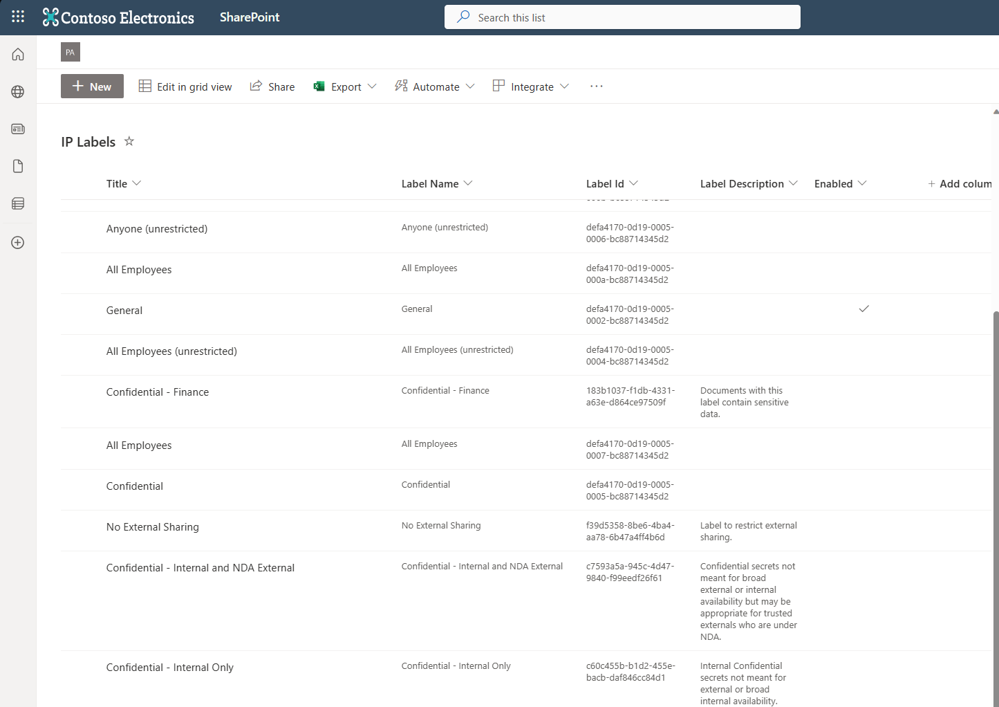
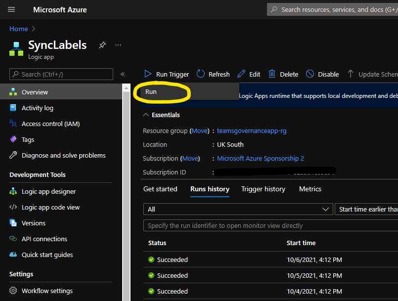
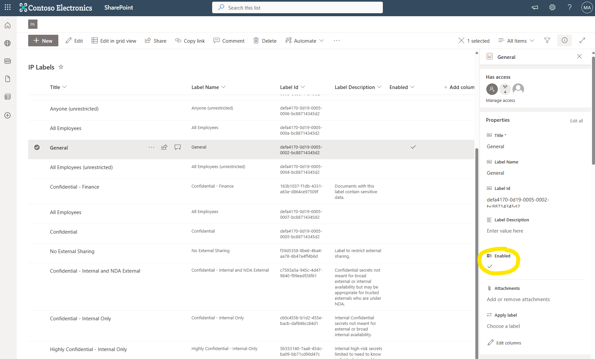
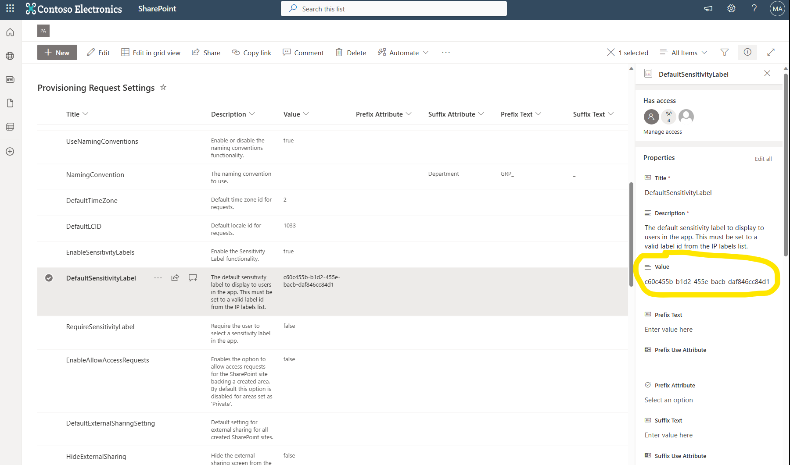

# Sensitivitetsmerker

Bestillingsportalen støtter anvendelse av sensitivitetsmerker på opprettede Teams eller Office 365 Groups.

For å bruke denne funksjonaliteten må sensitivitetsmerker være aktivert for Teams og Groups. Mer informasjon finnes på <https://learn.microsoft.com/en-us/microsoft-365/compliance/sensitivity-labels-teams-groups-sites?view=o365-worldwide>.

**Du må ha merker opprettet i Microsoft Purview Compliance Portal og publisert med Label Policies før dette fungerer. Vent 24 timer etter at merker er opprettet og publisert før du følger denne veiledningen.**

Funksjonaliteten må aktiveres og konfigureres for å fungere.

## Hvordan merkingen skjer

`ConfigureSpace`-runbooken setter merket med **Automation-kontoens system-assigned managed identity** – app-only, uten tjenestekonto, client secret eller Key Vault:

```powershell
Set-PnPTenantSite -Identity $siteUrl -SensitivityLabel $sensitivityLabel
```

Kallet går via SharePoints tenant-admin-API, som propagerer container-merket til den koblede Microsoft 365-gruppen på tjenersiden. Det er derfor merkingen fungerer app-only selv om Microsoft Graph **fortsatt ikke** støtter `assignedLabels` på grupper med Application permissions (re-verifisert august 2026 mot [group-update](https://learn.microsoft.com/en-us/graph/api/group-update)) – vi bruker en annen vei enn den begrensningen gjelder for.

Runbooken **leser alltid tilbake** `assignedLabels` på gruppen etterpå, fordi `Set-PnPTenantSite` har vært rapportert å lykkes uten å sette merket ([pnp/powershell#4917](https://github.com/pnp/powershell/issues/4917)). Uteblir merket, feiler steget med en melding som navngir de sannsynlige årsakene. Det er gruppen som er sannhetskilden – der styrer merket privacy og gjestedeling.

Målt 4. august 2026 i testtenant, gruppetilknyttet område uten merke fra før:

| | Resultat |
|--|--|
| `Set-PnPTenantSite -SensitivityLabel` app-only | Returnerte uten feil |
| Merke på området | Satt |
| Merke på gruppens `assignedLabels` | Satt |
| Propageringstid | Under 15 sekunder |

> **Historikk:** tidligere versjoner brukte en ROPC-flyt med en tjenestekonto **uten MFA** og en Entra ID-app med client secret, fordi Graph-begrensningen ble antatt å være uomgåelig. Den flyten, Key Vault-en, app-registreringen og MFA-kravet er fjernet i denne versjonen. Eksisterende installasjoner må rydde bort restene manuelt – se [Oppgraderingsveiledningen](./Upgrade.md).

Vil du verifisere oppførselen i din egen tenant, ligger [`Source/Diagnostics/Test-AppOnlySensitivityLabel.ps1`](Source/Diagnostics/Test-AppOnlySensitivityLabel.ps1) i repoet. Den gjør kallet mot et testområde du peker på, poller `assignedLabels` i opptil fem minutter og skriver ut en entydig konklusjon. Se [Source/Diagnostics/README.md](Source/Diagnostics/README.md).

For områder **uten** tilknyttet Microsoft 365-gruppe settes merket på selve området, og det er ingenting å verifisere mot en gruppe.

Vi går først gjennom hvordan funksjonaliteten fungerer, og deretter hvordan du aktiverer den.

### Hvordan ser dette ut?

Sensitivitetsmerker hentes fra Purview via Microsoft Graph API. En Logic App kalt `SyncLabels` utfører synkroniseringen. Logic App-en er som standard satt til å kjøre ukentlig – dette kan endres ved behov.

Merker lagres som listeelementer i en SharePoint-liste kalt `IP Labels` i SharePoint-området som står bak Bestillingsportalen.



For at et merke skal vises i Bestillingsportalen webdel eller Teams app, må `Enabled`-kolonnen være huket av.

`SyncLabels` filtrerer allerede på `contentFormats` og synkroniserer kun merker som gjelder `site` eller `unifiedgroup` – document/email-merker skal derfor ikke havne i listen. (Tidligere versjoner av dette dokumentet oppgav at Graph ikke støttet slik filtrering; det stemmer ikke lenger.) `Enabled`-kolonnen fungerer nå først og fremst som en manuell «hvilke av disse skal brukerne faktisk få velge»-bryter. Ser du likevel document/email-merker i listen, sørg for at de ikke er markert som `Enabled`, og meld det inn – da er filteret for løst.

Du kan validere hvilke merker som kan anvendes på områder/grupper via Security & Compliance Center.

Hvis funksjonaliteten er aktivert, vises merkene til brukeren i en kombinasjonsboks på «Datakategorisering»-skjermen.

Du kan angi et standardmerke og velge om brukeren må velge et merke ved å konfigurere innstillingene `DefaultSensitivityLabel` og `RequireSensitivityLabel` i `Provisioning Request Settings`-listen. Dette dekkes i Konfigurasjon-seksjonen nedenfor.

## Aktivere funksjonaliteten

Det finnes to måter å aktivere funksjonaliteten på:

1. Under kjøring av skriptet – en parameter `EnableSensitivity` finnes i `parameters.json` som aktiverer sensitivitetsmerke-funksjonaliteten. Hvis den er satt til `true`, aktiveres funksjonaliteten automatisk. Dette er dokumentert i [Installasjonsveiledningen](./Deployment-guide.md).

2. Manuell aktivering – Følg stegene nedenfor for å aktivere funksjonaliteten manuelt hvis du ikke aktiverte den i `parameters.json`.

### Manuell aktivering

Aktiveringen består nå av to steg – det kreves ingen secrets, ingen app-registrering og ingen tjenestekonto.

1. Gå til listen **`Provisioning Request Settings`** i SharePoint-området.
2. Rediger listeelementet **`EnableSensitivityLabels`** og sett `Value`-feltet til **`true`**. Standardverdien er `false`. Dette er også kill-switchen: står den på `false`, hopper `ConfigureSpace` over merkingen selv om en bestilling inneholder en label-ID.
3. Finn Logic App-en **`SyncLabels`** i Azure Portal og klikk på den.
4. Klikk **`Run Trigger > Run`** og vent til kjøringen fullfører.



5. Gå til listen **`IP Labels`** i SharePoint-området og valider at merkene er tilstede (se skjermbildet av IP Labels-listen øverst i dokumentet). Hvis det ikke finnes noen listeelementer, har **`SyncLabels`** Logic App-en feilet under kjøring. Sjekk kjørehistorikken til Logic App-en og undersøk eventuelle feil.

`SyncLabels` bruker managed identity med app-tillatelsen `InformationProtectionPolicy.Read.All`, så synkroniseringen har aldri trengt en tjenestekonto.

## Konfigurasjon

Når aktivert kan funksjonaliteten konfigureres slik:

1. Hvis ikke allerede gjort, finn **`SyncLabels`** Logic App-en i Azure Portal og kjør den – **`Run Trigger > Run`**. Dette synkroniserer merkene inn i IP Labels-listen (se skjermbildet ovenfor).
2. Aktiver noen merker som skal vises i Bestillingsportalen webdel eller Teams app ved å redigere listeelementene, sette **`Enabled`**-kolonnen til **`true`** og lagre elementene.



3. Angi et standardmerke (valgfritt) ved å sette verdien på listeelementet **`DefaultSensitivityLabel`** i listen **`Provisioning Request Settings`** til merkets ID (label id). ID-en må **nøyaktig** matche en gyldig `LabelId` fra IP Labels-listen. Du finner ID-en i kolonnen **`Label Id`**.



4. Velg om brukeren må velge et merke (valgfritt). Standardverdien er **`false`**, som betyr at brukeren ikke er tvunget til å velge et merke og kombinasjonsboksen kan stå tom. For å tvinge brukere til å velge et merke, sett verdien på listeelementet **`RequireSensitivityLabel`** til **`true`**.
5. Funksjonaliteten er nå konfigurert. Når brukere starter Bestillingsportalen webdel eller Teams app for å bestille samarbeidsområder, vil de se sensitivitets-kombinasjonsboksen på «Datakategorisering»-steget (kun for `Microsoft Teams Team` eller `Office 365 Group`).
