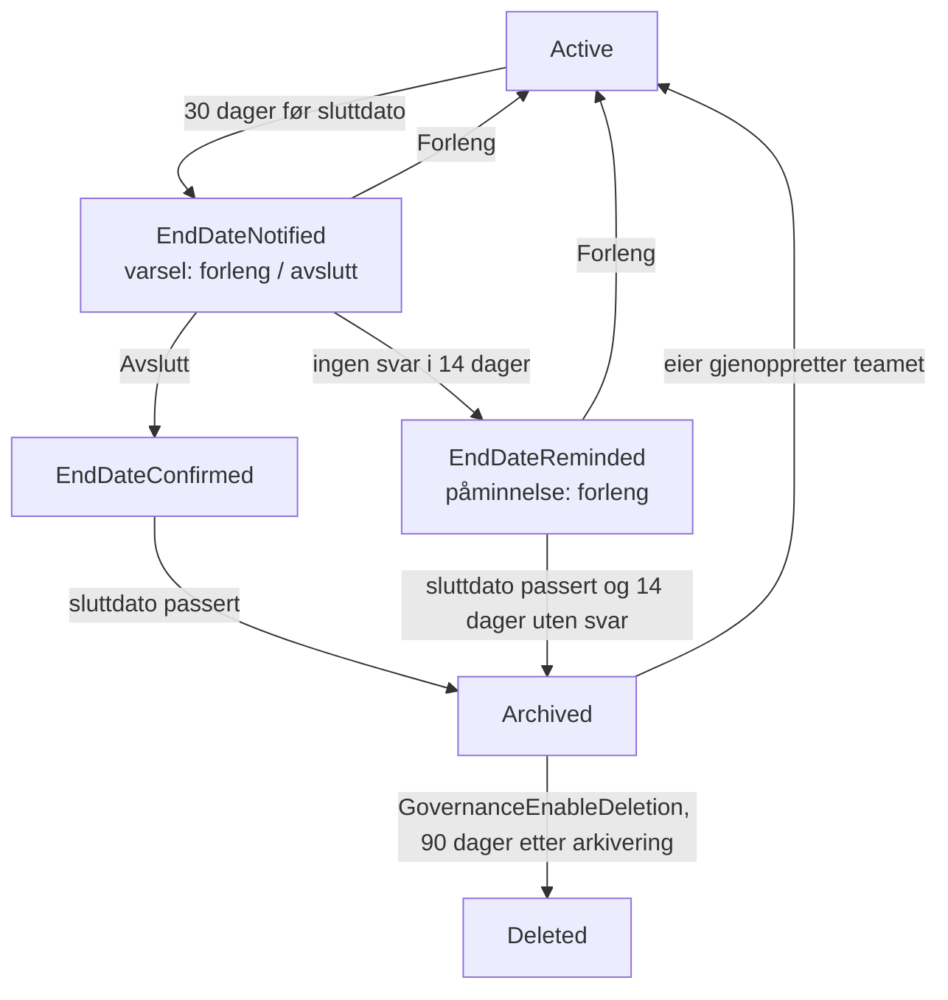
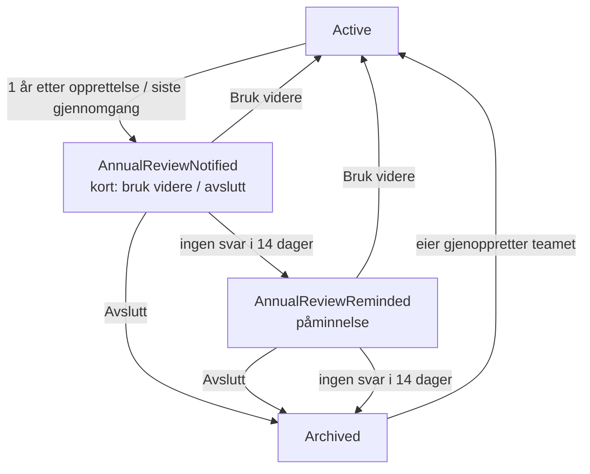

# Teams governance

Teams governance er en **valgfri modul** som styrer livssyklusen til team i tenanten etter at de er opprettet:

- **Team med sluttdato** får varsel før sluttdatoen, påminnelse hvis ingen svarer, og blir arkivert når sluttdatoen er passert. Eierne kan forlenge sluttdatoen direkte fra varselet. Automatisk sletting etter arkivering kan slås på, men er av som standard.
- **Team uten sluttdato** får en **årlig gjennomgang**. En eier bekrefter at teamet fortsatt er i bruk, eller avslutter det. Kommer det ikke noe svar etter påminnelsen, arkiveres teamet. Team uten sluttdato slettes aldri automatisk.
- **Team uten eiere** rapporteres ukentlig på e-post til IT.

Varslene er adaptive kort i en Teams-gruppechat med teamets eiere. Svarene behandles direkte fra kortet: den som svarer, identifiseres av Teams, og kortet byttes ut med et kvitteringskort slik at ingen kan svare to ganger.

Modulen bygger på en governance-løsning utviklet for Hå kommune, men er bygget om til Bestillingsportalens mønster: ARM-maler, installasjon med `deploy.ps1`, felles managed identity og API-tilkoblinger, og innstillinger i `Provisioning Request Settings`.

> **Installert betyr ikke påslått.** Med `enableGovernance` installeres modulen **avslått** (`GovernanceEnabled=false`) og i **tørrkjøringsmodus** (`GovernanceDryRun=true`). Ingenting sendes, arkiveres eller slettes før dere selv slår det på. Følg [Utrulling](#utrulling).

## Innhold

- [Prosess](#prosess)
- [Komponenter](#komponenter)
- [Installasjon](#installasjon)
- [Innstillinger](#innstillinger)
- [Utrulling](#utrulling)
- [Drift og feilsøking](#drift-og-feilsøking)
- [Samspill med andre livssyklusmekanismer](#samspill-med-andre-livssyklusmekanismer)
- [Tilganger](#tilganger)
- [Kjente begrensninger](#kjente-begrensninger)

## Prosess

Bare objekter som er **team** (Microsoft 365-grupper med Teams) omfattes av varsler og arkivering, siden Graph bare kan arkivere team. Rene Microsoft 365-grupper, for eksempel Viva Engage-fellesskap eller Planner-grupper, synkroniseres til listen, men får ingen varsler. Team med `ExcludeFromGovernance = Ja` hoppes over i alle steg.

Fristene under er standardverdier. Alle kan endres i [Innstillinger](#innstillinger).

### Team med sluttdato



- Hvis sluttdatoen settes nærmere enn 30 dager frem i tid, kommer varselet neste morgen. Et team som har fått påminnelse, arkiveres tidligst 14 dager etter påminnelsen, selv om sluttdatoen allerede er passert.
- En eier som forlenger, velger ny sluttdato i kortet. Teamet går da tilbake til `Active` og får nytt varsel før den nye datoen.
- Før et team slettes, sjekker flyten at det fortsatt er arkivert. Har eierne gjenopprettet det, slettes det ikke.

### Team uten sluttdato (årlig gjennomgang)



Gjenoppretter en eier et arkivert team, regnes det som en bekreftelse på at teamet er i bruk. Neste gjennomgang kommer da om ett år.

### Sluttdatoen

Sluttdatoen hentes fra bestillingen, altså feltet `ExpirationDate` i `Provisioning Requests`. Det skjer når **`EnableExpirationDate`** er slått på, slik at bestilleren kan velge en utløpsdato i skjemaet. Datoen leses bare første gang teamet synkroniseres. Senere endringer gjøres i `Teams Governance`-listen, eller av eierne fra varselkortet.

Når `GovernanceEnabled` er på, lar `ProcessProvisionRequest` være å overskrive `ExpirationDate` med datoen fra Entra ID sin utløpspolicy for grupper. Den datoen fornyes automatisk når gruppen er i bruk, og skal ikke styre arkivering.

Team som ikke er bestilt gjennom portalen, eller som er bestilt uten utløpsdato, havner i den årlige gjennomgangen. En administrator kan når som helst sette eller endre `End Date` direkte i listen.

## Komponenter

Alt ligger i Bestillingsportalens egen ressursgruppe og på det samme SharePoint-området.

| Komponent | Type | Beskrivelse |
|--|--|--|
| `GovernanceSync` | Logic App, daglig kl. 03:00 | Synkroniserer alle Microsoft 365-grupper fra Graph til `Teams Governance`: nye grupper, endringer (navn, eiere, synlighet, beskrivelse), slettede grupper, team arkivert eller gjenopprettet utenfor governance. Oppdaterer bare elementer som faktisk er endret. Kjører selv om `GovernanceEnabled` er av, slik at listen er klar før modulen slås på. |
| `GovernanceEndDate` | Logic App, daglig kl. 08:00 | Varsler, påminnelser, arkivering og (valgfritt) sletting for team med sluttdato. |
| `GovernanceAnnualReview` | Logic App, daglig kl. 09:00 | Årlig gjennomgang, påminnelse og arkivering for team uten sluttdato. Sender ukentlig rapport om team uten eiere (mandager). |
| `GovernanceNotify` | Logic App (barneflyt) | Poster ett kort i governance-chatten, venter på svar i opptil 14 dager og behandler svaret. Kalles av de to daglige flytene med en `Workflow`-action, uten URL eller nøkkel. |
| `Teams Governance` | SharePoint-liste | Register over alle grupper med governance-status. Visningene *Action Required*, *Archived Teams*, *Excluded Teams* og *Teams Without Owners* er klare til bruk. |
| `Governance Log` | SharePoint-liste | Revisjonslogg over alt modulen gjør: varsler, svar (med hvem som svarte), arkivering, sletting, feil og tørrkjøring. |

Varslene postes av **Flow bot** via Teams-tilkoblingen `bestillingsportalen-teams` (tjenestekontoen). For hvert første varsel opprettes en ny gruppechat med teamets eiere og tjenestekontoen. Påminnelser gjenbruker chatten.

## Installasjon

1. Sett `enableGovernance` til `true` i `parameters.json`.
2. Kjør `deploy.ps1` (fullinstallasjon eller `-Upgrade`). Skriptet:
   - oppretter listene `Teams Governance` og `Governance Log` (de følger alltid med PnP-malen)
   - deployer de fire Logic Appene
   - gir managed identityen app-rollene `TeamSettings.ReadWrite.All` og `Chat.Create`
   - advarer i pre-flight hvis Entra ID har en utløpspolicy som gjelder alle grupper, se [Samspill med andre livssyklusmekanismer](#samspill-med-andre-livssyklusmekanismer)
3. Kjøres `deploy.ps1` med `-SkipAppRoles`, får kommandoen for Global Administrator med seg `-IncludeGovernance`.
4. Kontroller at Teams-tilkoblingen `bestillingsportalen-teams` er autorisert. Den er den samme som portalen allerede bruker.

Uten `enableGovernance` deployes ingen av Logic Appene, og managed identityen får ingen nye roller. Listene og innstillingene opprettes likevel, men blir stående tomme.

## Innstillinger

Alle innstillingene ligger i `Provisioning Request Settings` og leses ved hver kjøring. Endringer trer i kraft neste morgen uten ny installasjon.

| Innstilling | Standard | Beskrivelse |
|--|--|--|
| `GovernanceEnabled` | `false` | Hovedbryter for varsler, arkivering og sletting. `GovernanceSync` kjører uansett. |
| `GovernanceDryRun` | `true` | Logger bare hva som *ville* skjedd (`LogAction = DryRun`). Ingen kort, ingen arkivering. |
| `GovernanceScope` | `All` | `All` = alle Microsoft 365-grupper i tenanten. `Portal` = bare grupper bestilt gjennom Bestillingsportalen, det vil si de som har `GroupId` i `Provisioning Requests`. |
| `GovernanceEnableDeletion` | `false` | Slett team med sluttdato automatisk etter `GovernanceDeleteAfterDays`. |
| `GovernanceNotifyDaysBeforeEndDate` | `30` | Dager før sluttdato det første varselet sendes. |
| `GovernanceReminderDays` | `14` | Dager uten svar før påminnelse, og før arkivering etter påminnelsen. |
| `GovernanceDeleteAfterDays` | `90` | Dager fra arkivering til sletting. |
| `GovernanceAnnualReviewDays` | `365` | Intervall for årlig gjennomgang. |
| `GovernanceMaxNotificationsPerRun` | `25` | Maks antall team per steg (varsel, påminnelse, arkivering, sletting) per kjøring. |
| `GovernanceITEmail` | (tom) | Mottaker av ukentlig rapport om team uten eiere. Tom = ingen rapport. |
| `GovernanceGuideUrl` | (tom) | Lenke til organisasjonens egne retningslinjer for Teams. Vises i kortene. Tom = skjules. |
| `GovernanceLanguage` | `nb-no` | Språk i kortene: `nb-no`, `nn-no` eller `en-us`. |
| `EnableExpirationDate` | `false` | Eksisterende innstilling. Må være på for at bestillingens utløpsdato blir sluttdato. |

## Utrulling

Den første kjøringen finner typisk hundrevis av team som er eldre enn ett år og aldri har vært gjennomgått. Rull derfor ut i tre trinn:

1. **Fyll listen.** Etter installasjonen kjører `GovernanceSync` neste natt, eller start den manuelt i Azure-portalen. Kontroller `Teams Governance`: stemmer eiere, typer og sluttdatoer? Sett `ExcludeFromGovernance` på team som ikke skal omfattes, for eksempel org-wide team og team eid av IT.
2. **Tørrkjør.** Sett `GovernanceEnabled=true` og behold `GovernanceDryRun=true`. Hver morgen logges `DryRun`-rader i `Governance Log` for de teamene som ville fått varsel eller blitt arkivert, begrenset av `GovernanceMaxNotificationsPerRun`. Gå gjennom loggen i noen dager.
3. **Slå på.** Sett `GovernanceDryRun=false`. Med standardverdien 25 får inntil 25 team varsel per steg per dag, slik at utsendelsen fordeles over flere dager. Øk verdien når dere ser at det går bra. Slå eventuelt på sletting (`GovernanceEnableDeletion`) til slutt.

Vil dere teste kortene først, gi et testteam kort sluttdato i listen: `End Date` noen dager frem, status `Active`. Sett gjerne `GovernanceScope=Portal` i en tidlig fase.

## Drift og feilsøking

- **`Governance Log`** er første sted å se. Hver handling logges med team, handling og detaljer. Svar logges med hvem som svarte (`PerformedBy`).
- **`NotificationFailed`** betyr at chatten ikke kunne opprettes, eller at kortet ikke kunne postes. Status settes da tilbake, og neste kjøring prøver på nytt. Vanlige årsaker er at Teams-tilkoblingen må autoriseres på nytt, eller at eieren ikke har Teams-lisens.
- **`NotificationExpired`**: ingen svarte innen 14 dager. Et kort om at varselet er utløpt, postes i chatten, og prosessen går videre til påminnelse eller arkivering.
- **`ArchiveError` / `DeleteError`** inneholder statuskoden og svaret fra Graph.
- **Kjøringshistorikken** til Logic Appene i Azure-portalen viser detaljer. `GovernanceNotify` har én kjøring per kort, og den står som *Running* til noen svarer eller fristen går ut.
- **Et team skal ikke styres:** sett `ExcludeFromGovernance`. **Et team skal få ny frist:** endre `End Date` og sett status til `Active`.

## Samspill med andre livssyklusmekanismer

- **Entra ID sin utløpspolicy for grupper** (`groupLifecyclePolicies`) fornyer grupper som er i bruk, og sletter grupper som ikke fornyes. Den kjører uavhengig av governance. Pre-flight i `deploy.ps1` advarer hvis policyen gjelder alle grupper. Velg én hovedmekanisme. Bruker dere governance, bør utløpspolicyen enten slås av eller begrenses til utvalgte grupper, eller ha en levetid som er lengre enn governance-syklusen.
- **SharePoint Advanced Management** (policyer for inaktive områder og for eierskap) kan gi eiere tilsvarende varsler for de samme områdene. Unngå at begge sender varsel for samme team.
- **Oppbevaringspolicyer i Purview** gjelder uavhengig av arkivering og sletting. Innhold som skal oppbevares, beholdes selv om teamet slettes.

## Tilganger

| Identitet | Tilgang | Brukes til |
|--|--|--|
| Managed identity (`bestillingsportalen-uami`) | Graph `TeamSettings.ReadWrite.All` (ny) | `POST /teams/{id}/archive`, `GET /teams/{id}?$select=isArchived`, samlet i `$batch` |
| | Graph `Chat.Create` (ny) | `POST /chats`, gruppechat med eierne |
| | Graph `Group.ReadWrite.All` (finnes) | Lese alle grupper med eiere, `DELETE /groups/{id}` |
| | SharePoint `Sites.FullControl.All` (finnes) | Lese og skrive governance-listene og innstillingene via SharePoint REST |
| Tjenestekonto via `bestillingsportalen-teams` (finnes) | Delegert | Poste og oppdatere kort som Flow bot, og vente på svar |
| Tjenestekonto via `bestillingsportalen-o365` (finnes) | Delegert | Ukentlig e-post om team uten eiere |

Modulen trenger **ikke** `Chat.ReadWrite.All`, `Mail.Send` eller Graph `Sites.ReadWrite.All`, i motsetning til Hå-versjonen den bygger på.

## Kjente begrensninger

- Kortene utløper etter fast 14 dager, som er Teams-connectorens ventetid i `GovernanceNotify`. Settes `GovernanceReminderDays` lavere, kan både det første kortet og påminnelsen være aktive samtidig. Et svar på et av dem behandles da riktig.
- Et utløpt kort beholder knappene, men de virker ikke lenger. Et nytt kort i chatten forteller at varselet er utløpt. Å oppdatere det gamle kortet ville krevd `Chat.ReadWrite.All`.
- Eiere som er tjenestekontoer (service principals), tas ikke med i chatten. Et team med bare slike eiere regnes som et team uten eiere.
- Tjenestekontoen blir deltaker i én gruppechat per team som får varsel.
- Team med bare én eier gir en gruppechat med to deltakere (eieren og tjenestekontoen). Dette bør verifiseres i testtenanten før utrulling.
- Nye eller endrede eiere oppdages ved neste synkronisering (natt til neste dag).

## Vedlikehold

De fire Logic App-malene (`Source/ARMTemplates/LogicApps/governance*.json`) er **generert** fra `Source/Scripts/Governance/`. Korttekster, filtre og handlinger endres der, og deretter kjøres:

```bash
node Source/Scripts/Governance/build.js      # skriver de fire malene på nytt
node Source/Scripts/Governance/validate.js Source/ARMTemplates/LogicApps/governance*.json
```

`validate.js` sjekker statisk at alle `runAfter`, `body()`, `outputs()`, `items()`, `variables()` og `parameters()` peker på noe som finnes, og at uttrykkene er balanserte. Endringer gjort direkte i de genererte JSON-filene, eller i designeren i Azure, overskrives ved neste generering og deploy.
